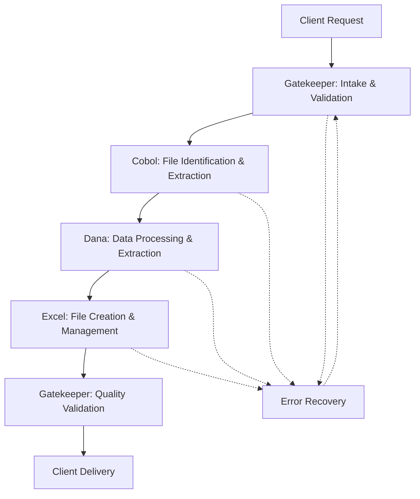

# Bob's Insurance Multi-Agent Team Workflow Documentation

## Overview

The Bob's Insurance multi-agent team is designed to handle specialized client requests for COBOL file processing, data extraction, and Excel file management. The team follows a sequential workflow pattern with a central orchestrator managing the process and ensuring quality delivery.

## Team Architecture

### Agent Composition

| Agent Role | Agent Name | Agent Key | Primary Function |
|------------|------------|-----------|------------------|
| **Orchestrator** | Gatekeeper | `gatekeeper_bobs` | Client interface, workflow coordination, quality assurance |
| **COBOL Specialist** | Cobol | `cobol_interpreter_bobs` | COBOL file interpretation and data extraction |
| **Data Analyst** | Dana | `data_extractor_bobs` | Insurance data extraction and processing |
| **File Manager** | Excel | `excel_manager_bobs` | Excel file creation and management |

### Team Design Principles

1. **Sequential Processing**: Each agent completes their work before handoff to maintain context control
2. **Clear Role Separation**: Each agent has distinct expertise and responsibilities
3. **Orchestrator Control**: Gatekeeper maintains overall workflow state and client communication
4. **Quality Gates**: Validation checkpoints between each major phase
5. **Recovery-First Design**: Each step is resumable after failure with proper state tracking

## Workflow Process

### Standard Client Request Flow



### Detailed Workflow Steps

#### Phase 1: Client Intake (Gatekeeper)
**Responsibilities:**
- Receive and acknowledge client request
- Validate file identifier/code completeness
- Set client expectations for processing timeline
- Initialize workflow tracking in planning tool

**Critical Markers:**
- ✅ Client request acknowledged within 5 minutes
- ✅ File identifier validated and complete
- ✅ Workflow plan created with tracking ID
- ✅ Client informed of processing steps

**Handoff Criteria:**
- Complete client request with validated file identifier
- Clear specification of data extraction requirements
- Established workflow tracking and communication plan

#### Phase 2: COBOL File Processing (Cobol)
**Responsibilities:**
- Interpret client file identifier (code/number/reference)
- Locate and access corresponding COBOL file
- Analyze file structure and record layouts
- Extract complete file information and metadata

**Critical Markers:**
- ✅ File successfully identified and located
- ✅ COBOL structure parsed and documented
- ✅ Data content extracted and validated
- ✅ Structured data package prepared for handoff

**Handoff Criteria:**
- Complete file structure documentation
- All relevant data extracted and organized
- Field definitions and data types documented
- Quality validation completed

**Handoff Package Format:**
```
FILE_IDENTIFICATION:
  - File Name/ID: [client identifier]
  - File Type: [COBOL file characteristics]
  - Record Count: [total records processed]
  - Processing Timestamp: [completion time]

RECORD_STRUCTURE:
  - Field Definitions: [name, position, length, type]
  - Data Hierarchies: [relationships and groupings]
  - Key Fields: [primary/secondary identifiers]

DATA_CONTENT:
  - Representative Samples: [data examples]
  - Value Ranges: [min/max for numeric fields]
  - Data Quality Assessment: [completeness metrics]
```

#### Phase 3: Data Extraction (Dana)
**Responsibilities:**
- Analyze client-specific data requirements
- Extract requested insurance information from COBOL data
- Process state-specific, rate, or regulatory data as needed
- Format data for optimal Excel presentation

**Critical Markers:**
- ✅ Client requirements mapped to available data
- ✅ Specific data elements extracted accurately
- ✅ Data formatted for Excel compatibility
- ✅ Quality validation against client specifications

**Handoff Criteria:**
- All requested data elements extracted
- Data formatted in Excel-ready structure
- Metadata and processing notes included
- Quality validation completed

**Handoff Package Format:**
```
DATA_PACKAGE:
  METADATA:
    - Client Request ID: [tracking identifier]
    - Extraction Timestamp: [completion time]
    - Source File Reference: [original COBOL file info]
    - Record Coverage: [scope of extraction]
  
  EXTRACTED_DATA:
    - Column Headers: [with data type specifications]
    - Formatted Data Rows: [client-requested information]
    - Calculated Fields: [derived values and formulas]
    - Summary Statistics: [totals, counts, averages]
  
  QUALITY_METRICS:
    - Completeness Score: [percentage of requested data found]
    - Accuracy Validation: [cross-check results]
    - Processing Notes: [any special handling applied]
```

#### Phase 4: Excel File Management (Excel)
**Responsibilities:**
- Create, update, or modify Excel files as specified
- Apply professional formatting and Bob's Insurance branding
- Implement formulas, calculations, and data validation
- Ensure file accessibility and proper file path management

**Critical Markers:**
- ✅ Excel file created/modified successfully
- ✅ Professional formatting applied consistently
- ✅ All data imported accurately with proper formatting
- ✅ File accessibility verified at specified location

**Handoff Criteria:**
- Excel file completed and validated
- Professional appearance meeting Bob's Insurance standards
- File accessible from specified path/location
- Quality assurance checklist completed

#### Phase 5: Final Validation & Delivery (Gatekeeper)
**Responsibilities:**
- Review complete deliverable against original client request
- Validate all critical parameters have been met
- Confirm file accessibility and functionality
- Provide final delivery confirmation to client

**Critical Markers:**
- ✅ Deliverable matches original client requirements
- ✅ Quality standards met throughout workflow
- ✅ File accessibility confirmed
- ✅ Client delivery completed with confirmation

## Critical Success Factors

### Quality Gates
Each phase includes mandatory validation checkpoints:

1. **Input Validation**: Verify completeness before processing
2. **Process Validation**: Confirm successful completion of core tasks
3. **Output Validation**: Verify deliverable quality before handoff
4. **Client Validation**: Ensure final deliverable meets requirements

### Error Recovery Procedures

#### Agent Failure Recovery
- **Immediate Response**: Identify failure point and document cause
- **Alternative Approaches**: Attempt different processing methods if available
- **Escalation Protocol**: Engage Gatekeeper for coordination and client communication
- **State Preservation**: Maintain workflow state for resumption

#### Data Quality Issues
- **Validation Failure**: Re-examine source data and processing logic
- **Incomplete Data**: Identify gaps and determine alternative sources
- **Format Issues**: Adjust processing parameters and re-execute
- **Client Clarification**: Engage Gatekeeper for requirement clarification

### Performance Standards

| Metric | Target | Critical Threshold |
|--------|--------|--------------------|
| Client Acknowledgment | < 5 minutes | < 10 minutes |
| Standard Request Processing | < 30 minutes | < 60 minutes |
| Complex Request Processing | < 2 hours | < 4 hours |
| File Accessibility Verification | 100% | 100% |
| Data Accuracy | 99.9% | 99% |

## Communication Protocols

### Inter-Agent Communication
- **Status Updates**: Regular progress reporting to Gatekeeper
- **Handoff Notifications**: Clear completion signals with data packages
- **Issue Escalation**: Immediate notification of problems or delays
- **Context Preservation**: Complete information transfer between agents

### Client Communication (via Gatekeeper)
- **Initial Acknowledgment**: Confirm request receipt and processing plan
- **Progress Updates**: Status reports every 15 minutes for complex requests
- **Issue Notifications**: Transparent communication of delays or complications
- **Final Delivery**: Confirmation of completion with deliverable details

## Planning Tool Integration

### Workflow Tracking
The Gatekeeper uses workspace planning tools to:
- Create workflow plans for each client request
- Track progress through each processing phase
- Maintain delegation history and results
- Document quality validation outcomes
- Store recovery information for failed processes

### Metadata Management
Key information stored in planning tool:
- Client request specifications and requirements
- Processing timestamps and duration metrics
- Quality validation results and scores
- File locations and accessibility confirmations
- Lessons learned and process improvements

## Team Coordination Best Practices

### Context Management
- **Proactive State Tracking**: Maintain complete workflow context
- **Information Handoffs**: Ensure complete data transfer between agents
- **Recovery Preparation**: Store sufficient state for process resumption
- **Audit Trails**: Document all processing steps and decisions

### Quality Assurance
- **Validation at Every Step**: Implement quality checks throughout workflow
- **Client Requirement Focus**: Maintain alignment with original request
- **Professional Standards**: Apply Bob's Insurance quality standards consistently
- **Continuous Improvement**: Learn from each workflow execution

## Success Metrics and KPIs

### Operational Metrics
- **Request Processing Time**: Average time from intake to delivery
- **First-Pass Success Rate**: Percentage of requests completed without rework
- **Client Satisfaction**: Feedback scores and repeat request rates
- **Data Accuracy**: Error rates and correction requirements

### Quality Metrics
- **Deliverable Quality**: Professional appearance and functionality scores
- **Requirement Compliance**: Percentage of client requirements fully met
- **File Accessibility**: Success rate for file delivery and access
- **Process Efficiency**: Resource utilization and workflow optimization

## Continuous Improvement

### Learning Integration
- **Process Refinement**: Regular review and optimization of workflow steps
- **Agent Enhancement**: Improve individual agent capabilities based on experience
- **Quality Standards**: Evolve standards based on client feedback and industry best practices
- **Technology Adaptation**: Incorporate new tools and capabilities as available

### Performance Monitoring
- **Regular Reviews**: Weekly assessment of team performance metrics
- **Client Feedback Integration**: Incorporate client suggestions and requirements
- **Process Documentation**: Maintain current documentation of procedures and standards
- **Training Updates**: Keep agent capabilities current with business needs

---

## Implementation Notes

This workflow documentation serves as the operational guide for the Bob's Insurance multi-agent team. Each agent should reference their individual persona documentation for detailed role-specific instructions while following this overall workflow framework for coordinated team operations.

The team is designed for reliability, quality, and client satisfaction while maintaining the flexibility to handle various types of insurance data processing requests within the COBOL-to-Excel workflow pattern.