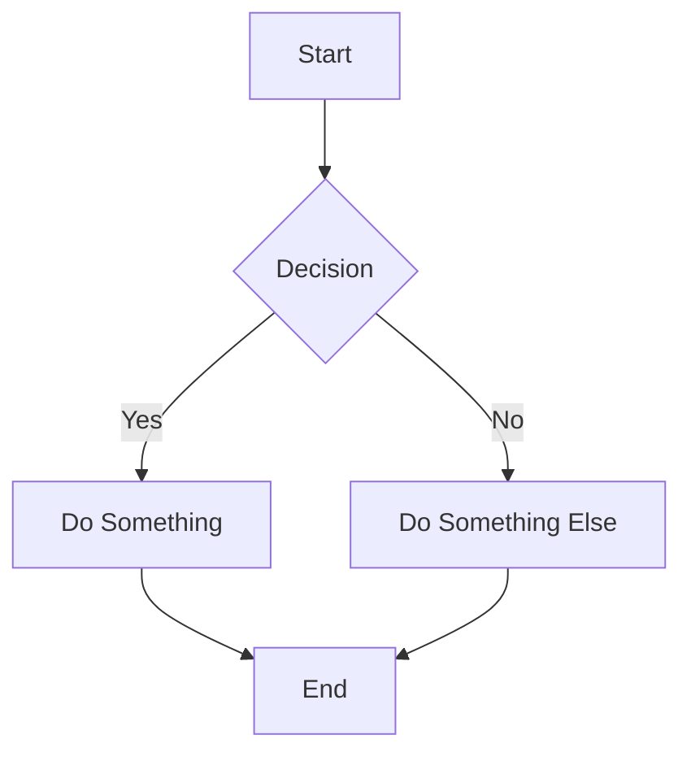
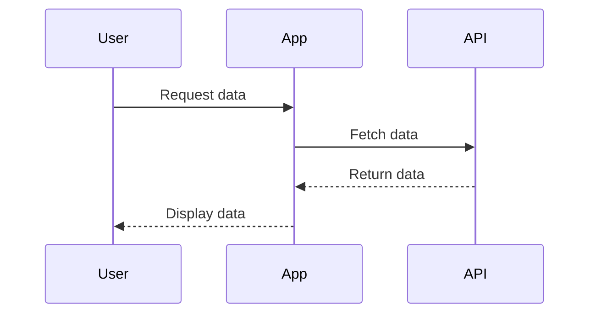
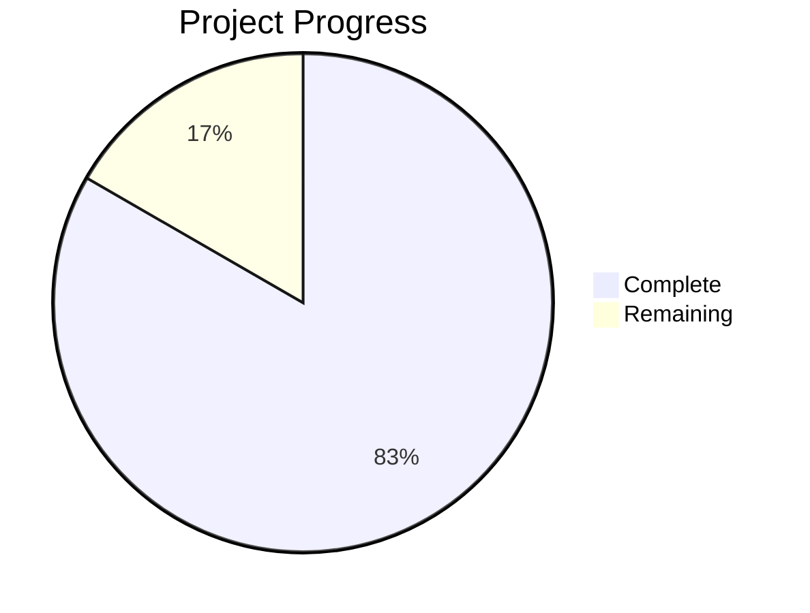

# Markdown Features Showcase & Test File

This document demonstrates all markdown features supported in the Agent C Realtime chat interface. Use this to test rendering and as a reference for available syntax.

---

## Table of Contents

---

## Basic Formatting

**Bold text** using `**bold**` or `__bold__`

*Italic text* using `*italic*` or `_italic_`

***Bold and italic*** using `***text***`

~~Strikethrough~~ using `~~text~~`

`Inline code` using backticks

Regular text with a line break  
Second line (two spaces at end of previous line)

Horizontal rule below:

---

## Headings

# H1 - Main Title
## H2 - Section
### H3 - Subsection
#### H4 - Sub-subsection
##### H5 - Minor heading
###### H6 - Smallest heading

---

## Lists

### Unordered Lists

- First item
- Second item
  - Nested item 2.1
  - Nested item 2.2
    - Deeply nested 2.2.1
- Third item

You can also use `*` or `+`:

* Item with asterisk
+ Item with plus

### Ordered Lists

1. First step
2. Second step
   1. Sub-step 2.1
   2. Sub-step 2.2
3. Third step

### Task Lists

- [x] Completed task
- [ ] Incomplete task
- [x] Another completed task

---

## Links & Images

### Links

[Inline link](https://example.com)

[Link with title](https://example.com "Link Title")

<https://example.com> (automatic link)

### Images


---

## Tables

### Simple Table

| Name | Age | Role |
|------|-----|------|
| Alice | 30 | Developer |
| Bob | 25 | Designer |
| Carol | 35 | Manager |

### Aligned Columns

| Left-aligned | Center-aligned | Right-aligned |
|:-------------|:--------------:|--------------:|
| Left | Center | Right |
| Text | More text | Numbers |
| Foo | Bar | 123 |

### Complex Table

| Feature | Status | Notes |
|---------|--------|-------|
| Collapsibles | ✅ Complete | Card 1 |
| Syntax Highlighting | ✅ Complete | Card 2 |
| Alerts | ✅ Complete | Card 3 |
| Math | ✅ Complete | Card 4 |
| Mermaid | ✅ Complete | Card 5 |
| TOC | ✅ Complete | Card 6 |

---

## Code & Syntax Highlighting

### Inline Code

Use `const variable = value` for inline code.

### Code Blocks

#### JavaScript
```javascript
// JavaScript code with syntax highlighting
function fibonacci(n) {
  if (n <= 1) return n;
  return fibonacci(n - 1) + fibonacci(n - 2);
}

console.log(fibonacci(10)); // 55
```

#### Python
```python
# Python code with syntax highlighting
def factorial(n):
    """Calculate factorial recursively"""
    if n <= 1:
        return 1
    return n * factorial(n - 1)

print(factorial(5))  # 120
```

#### TypeScript
```typescript
// TypeScript with types
interface User {
  id: number;
  name: string;
  email: string;
}

async function fetchUser(id: number): Promise<User | null> {
  try {
    const response = await fetch(`/api/users/${id}`);
    return await response.json();
  } catch (error) {
    console.error('Failed to fetch user:', error);
    return null;
  }
}
```

#### Ruby
```ruby
# Ruby code
class Calculator
  def self.add(a, b)
    a + b
  end
  
  def self.multiply(a, b)
    a * b
  end
end

puts Calculator.add(5, 3)      # 8
puts Calculator.multiply(4, 7) # 28
```

#### Bash
```bash
#!/bin/bash
# Shell script example

echo "Building project..."
npm install
npm run build

if [ $? -eq 0 ]; then
  echo "Build successful!"
else
  echo "Build failed!"
  exit 1
fi
```

#### JSON
```json
{
  "name": "agent-c-realtime",
  "version": "1.0.0",
  "dependencies": {
    "react": "^18.0.0",
    "typescript": "^5.0.0"
  },
  "scripts": {
    "build": "tsc",
    "test": "vitest"
  }
}
```

#### SQL
```sql
-- SQL query example
SELECT 
  users.id,
  users.name,
  COUNT(orders.id) as order_count
FROM users
LEFT JOIN orders ON users.id = orders.user_id
WHERE users.active = true
GROUP BY users.id, users.name
ORDER BY order_count DESC
LIMIT 10;
```

#### Plain Text (No Highlighting)
```
This is plain text without syntax highlighting.
It's useful for output logs or simple text blocks.
No keywords are colored.
```

---

## Collapsible Sections

### Basic Collapsible

<details>
<summary>Click to expand - Basic Example</summary>

This content is hidden by default and revealed when you click the summary.

You can include:
- Regular text
- **Bold** and *italic*
- `Inline code`
- Links: [Example](https://example.com)

</details>

### Collapsible with Code

<details>
<summary>Click to expand - Code Example</summary>

Here's a code block inside a collapsible section:

```python
def greet(name):
    return f"Hello, {name}!"

print(greet("World"))
```

</details>

### Collapsible with Lists

<details>
<summary>Click to expand - List Example</summary>

#### Steps to follow:

1. First step
2. Second step
   - Sub-step A
   - Sub-step B
3. Third step

- Additional item
- Another item

</details>

### Nested Collapsibles

<details>
<summary>Outer Collapsible</summary>

This is the outer content.

<details>
<summary>Inner Collapsible (Nested)</summary>

This is nested content inside the outer collapsible!

You can nest these as deeply as needed.

</details>

More content in the outer collapsible.

</details>

---

## GitHub-Style Alerts

### Note Alert

:::note
This is a **note** alert. Use it for general information that users should be aware of.

You can include:
- Lists and formatting
- `Code snippets`
- [Links](https://example.com)
- **Any markdown content**
:::

### Tip Alert

:::tip
💡 This is a **tip** alert. Use it for helpful advice or best practices.

Example tip: Always use semantic commit messages like `feat:`, `fix:`, `docs:` for better git history.
:::

### Important Alert

:::important
⚡ This is an **important** alert. Use it for crucial information users need to know.

**Critical**: Make sure to backup your data before proceeding with the upgrade!
:::

### Warning Alert

:::warning
⚠️ This is a **warning** alert. Use it for information that needs immediate attention.

**Warning**: Running this command will delete all local changes:
```bash
git reset --hard HEAD
```
:::

### Caution Alert

:::caution
🛑 This is a **caution** alert. Use it for serious warnings about risks or negative outcomes.

**DANGER**: Never commit API keys or secrets to version control. Use environment variables instead!
:::

### Alerts with Complex Content

:::important
### Multi-line Alert with Code

This alert contains:

1. A list
2. A code block
3. Multiple paragraphs

```javascript
// Example code in alert
const apiKey = process.env.API_KEY;
if (!apiKey) {
  throw new Error('API_KEY not configured');
}
```

Always validate your environment variables before deployment.
:::

---

## Math Equations

### Inline Math

The equation $E = mc^2$ is Einstein's famous mass-energy equivalence formula.

The Pythagorean theorem states that $a^2 + b^2 = c^2$ for right triangles.

Greek letters: $\alpha$, $\beta$, $\gamma$, $\pi$, $\sigma$, $\omega$

Inline fraction: $\frac{1}{2}$ or $\frac{a}{b}$

Summation: $\sum_{i=1}^{n} i = \frac{n(n+1)}{2}$

### Block Math (Display Style)

#### Quadratic Formula
$$
x = \frac{-b \pm \sqrt{b^2 - 4ac}}{2a}
$$

#### Integral
$$
\int_{-\infty}^{\infty} e^{-x^2} dx = \sqrt{\pi}
$$

#### Euler's Identity
$$
e^{i\pi} + 1 = 0
$$

#### Limit
$$
\lim_{x \to 0} \frac{\sin x}{x} = 1
$$

#### Summation
$$
\sum_{k=1}^{n} k^2 = \frac{n(n+1)(2n+1)}{6}
$$

#### Matrix
$$
\begin{bmatrix}
a & b \\
c & d
\end{bmatrix}
\begin{bmatrix}
x \\
y
\end{bmatrix}
=
\begin{bmatrix}
ax + by \\
cx + dy
\end{bmatrix}
$$

#### Complex Equation
$$
f(x) = \int_{-\infty}^{\infty} \hat{f}(\xi) e^{2\pi i \xi x} d\xi
$$

### Math in Other Markdown

Math works inside alerts:

:::note
The fundamental theorem of calculus states:
$$
\int_a^b f'(x) dx = f(b) - f(a)
$$
:::

Math works in lists:

1. First formula: $y = mx + b$
2. Second formula: $A = \pi r^2$
3. Third formula: $V = \frac{4}{3}\pi r^3$

Math works in tables:

| Concept | Formula |
|---------|---------|
| Area of circle | $A = \pi r^2$ |
| Circumference | $C = 2\pi r$ |
| Volume of sphere | $V = \frac{4}{3}\pi r^3$ |

---

## Blockquotes

### Simple Blockquote

> This is a blockquote. Use it for citations or emphasizing quoted text.
>
> Blockquotes can span multiple paragraphs.

### Nested Blockquote

> This is the first level of quoting.
>
> > This is nested blockquote (quoted quote).
> >
> > > And this is even deeper!

### Blockquote with Formatting

> **Important Note**: You can use *formatting* inside blockquotes.
>
> - Lists work too
> - Another item
>
> `Code also works`

---

## Advanced Features

### Combining Features

You can combine multiple features for rich content:

<details>
<summary>Click to see combination example</summary>

:::tip
### Math in Collapsible Alert!

The **Fibonacci sequence** can be expressed as:

$$
F_n = F_{n-1} + F_{n-2}
$$

With implementation:

```python
def fibonacci(n):
    if n <= 1:
        return n
    return fibonacci(n - 1) + fibonacci(n - 2)
```

**Remember**: This is a recursive solution. For large $n$, use dynamic programming!
:::

</details>

### Feature Matrix

| Feature | Syntax | Status | Card |
|---------|--------|--------|------|
| **Basic Markdown** | Standard | ✅ | Base |
| Headings | `# H1` to `###### H6` | ✅ | Base |
| Bold/Italic | `**bold**` `*italic*` | ✅ | Base |
| Lists | `-`, `*`, `1.` | ✅ | Base |
| Links | `[text](url)` | ✅ | Base |
| Images | `` | ✅ | Base |
| Tables | `\| col \| col \|` | ✅ | Base |
| Code | ` `code` `, ` ```lang ``` ` | ✅ | Base |
| **Collapsibles** | `<details><summary>` | ✅ | Card 1 |
| **Syntax Highlighting** | ` ```lang ``` ` | ✅ | Card 2 |
| **Alerts** | `:::type` | ✅ | Card 3 |
| **Math** | `$inline$` `$$block$$` | ✅ | Card 4 |
| **Mermaid** | ` ```mermaid ``` ` | ✅ | Card 5 |
| **TOC** | `## Table of Contents` | ✅ | Card 6 |

---

### Mermaid Diagrams (Card 5)

Render flowcharts, sequence diagrams, class diagrams, and more using Mermaid syntax.

**Example: Flowchart**


**Example: Sequence Diagram**


**Example: Pie Chart**


### Table of Contents (Card 6)

Automatic TOC generation from headings! Just add a "## Table of Contents" heading and the TOC will automatically populate.

**Example**:
```markdown
## Table of Contents

## Introduction
Content here...

## Main Section  
More content...

### Subsection
Details...
```

The TOC at the top of this document was automatically generated!

---

## Testing Checklist

Use this section to verify all features work correctly:

### Basic Features
- [ ] Headings render correctly (H1-H6)
- [ ] Bold, italic, strikethrough work
- [ ] Lists (ordered, unordered, nested) display properly
- [ ] Links are clickable and styled
- [ ] Images load and display
- [ ] Tables render with proper alignment
- [ ] Inline code has background
- [ ] Blockquotes are indented with border

### Card 1: Collapsibles
- [ ] Details/summary elements work
- [ ] Click to expand/collapse
- [ ] Chevron icon rotates
- [ ] Content inside renders correctly
- [ ] Nested collapsibles work
- [ ] Keyboard accessible (Enter/Space)

### Card 2: Syntax Highlighting
- [ ] Code blocks have syntax colors
- [ ] Multiple languages supported (JS, Python, etc.)
- [ ] Keywords colored correctly
- [ ] Strings, comments, functions distinct
- [ ] Copy button appears on hover
- [ ] Copy button works
- [ ] Dark mode syntax colors correct

### Card 3: Alerts
- [ ] Note alert (blue) renders
- [ ] Tip alert (green) renders
- [ ] Important alert (purple) renders
- [ ] Warning alert (yellow) renders
- [ ] Caution alert (red) renders
- [ ] Icons display correctly
- [ ] Markdown inside alerts works
- [ ] Theme colors appropriate

### Card 6: Table of Contents
- [ ] TOC heading detected
- [ ] TOC auto-generates list of headings
- [ ] Includes h2, h3, h4 headings
- [ ] Proper indentation for nested headings
- [ ] Links navigate to correct sections
- [ ] Smooth scrolling works
- [ ] No page reload on click
- [ ] Duplicate headings handled
- [ ] Special characters work
- [ ] Works with other markdown features

### Card 4: Math
- [ ] Inline math renders in text
- [ ] Block math renders centered
- [ ] Greek letters display
- [ ] Fractions render correctly
- [ ] Roots display properly
- [ ] Exponents/subscripts positioned correctly
- [ ] Matrices layout properly
- [ ] Invalid LaTeX shows error (doesn't crash)
- [ ] Math in alerts works
- [ ] Theme affects math colors

### Card 5: Mermaid Diagrams
- [ ] Flowcharts render correctly
- [ ] Sequence diagrams work
- [ ] Pie charts display
- [ ] Invalid syntax shows error (doesn't crash)
- [ ] Multiple diagrams in one message work
- [ ] Diagrams are responsive (scroll if too wide)
- [ ] Loading state appears briefly
- [ ] Error state is clear and helpful
- [ ] Diagrams render in light mode
- [ ] Diagrams render in dark mode

---

## End of Showcase

This file demonstrates all currently implemented markdown features. Use it to test rendering and as a reference for available syntax.

**Feature Status**: 6 of 6 cards complete (100%) 🎉

For issues or questions, refer to documentation in `.scratch/markdown_enhancements/`
