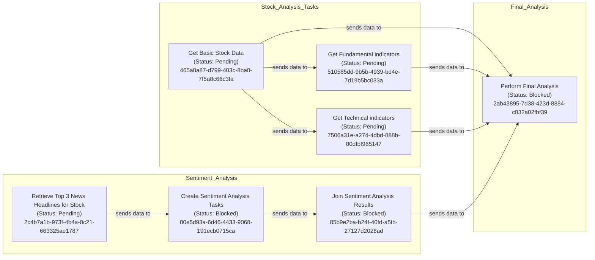

# Create Task Graphs
Given a series of tasks with parent-child relationships as well as dependencies, produce a visual graph using mermaid syntax.
Tasks should have name and status.

## Definitions
Parent-Child Relationships: These represent tasks that are hierarchical in nature. A parent task encompasses multiple child tasks. The child tasks must be completed before the parent task can be considered complete. These tasks do not share data.
Dependencies: These represent tasks that rely on the completion of other tasks and do share data. A task with dependencies cannot start until its prerequisite tasks are completed.

## Steps to create
1) Create a LR Flowchart in mermaid
2) User <br> instead of \n for line breaks
3) Create a subgraph for each group of tasks that should be logically grouped together.
4) Define the tasks within each subgraph.  Each task should be labeled wtih name, guid, and status.
5) Define the parent-child relationships between tasks when tasks that have parent GUIDs, using parent task `--executes before-->` child task.
6) Define the dependencies between tasks when task is a prerequiste for another task useing prerequisite task `-.sends data to .->` require by task.

## Example
Given this list of tasks
```json
{ "tasks": [
    {
      "id": "2ab43895-7d38-423d-8884-c832a02fbf39",
      "name": "Perform Final Analysis",
      "parent_task_id": null,
      "child_tasks": [],
      "prerequisite_tasks": [
        {
          "task_id": "510585dd-9b5b-4939-bd4e-7d19b5bc033a"
        },
        {
          "task_id": "85b9e2ba-b24f-40fd-a5fb-27127d2028ad"
        },
        {
          "task_id": "465a8a87-d799-403c-8ba0-7f5a8c66c3fa"
        },
        {
          "task_id": "7506a31e-a274-4dbd-888b-80dfbf965147"
        }
      ],
      "required_by_tasks": []
    },
    {
      "id": "85b9e2ba-b24f-40fd-a5fb-27127d2028ad",
      "name": "Join Sentiment Analysis Results",
      "parent_task_id": null,
      "child_tasks": [],
      "prerequisite_tasks": [
        {
          "task_id": "00e5d93a-6d46-4433-9068-191ecb0715ca"
        }
      ],
      "required_by_tasks": [
        {
          "task_id": "2ab43895-7d38-423d-8884-c832a02fbf39"
        }
      ]
     },
    {
      "id": "465a8a87-d799-403c-8ba0-7f5a8c66c3fa",
      "name": "Get Basic Stock Data",
      "parent_task_id": null,
      "child_tasks": [],
      "prerequisite_tasks": [],
      "required_by_tasks": [
        {
          "task_id": "2ab43895-7d38-423d-8884-c832a02fbf39"
        }
      ]
    },
    {
      "id": "510585dd-9b5b-4939-bd4e-7d19b5bc033a",
      "name": "Get Fundamental indicators",
      "parent_task_id": "465a8a87-d799-403c-8ba0-7f5a8c66c3fa",
      "child_tasks": [],
      "prerequisite_tasks": [],
      "required_by_tasks": [
        {
          "task_id": "2ab43895-7d38-423d-8884-c832a02fbf39"
        }
      ]
    },
    {
      "id": "2c4b7a1b-973f-4b4a-8c21-663325ae1787",
      "name": "Retrieve Top 3 News Headlines for Stock",
      "parent_task_id": null,
      "child_tasks": [],
      "prerequisite_tasks": [],
      "required_by_tasks": [
        {
          "task_id": "00e5d93a-6d46-4433-9068-191ecb0715ca"
        }
      ]
    },
    {
      "id": "00e5d93a-6d46-4433-9068-191ecb0715ca",
      "name": "Create Sentiment Analysis Tasks",
      "parent_task_id": null,
      "child_tasks": [],
      "prerequisite_tasks": [
        {
          "task_id": "2c4b7a1b-973f-4b4a-8c21-663325ae1787"
        }
      ],
      "required_by_tasks": [
        {
          "task_id": "85b9e2ba-b24f-40fd-a5fb-27127d2028ad"
        }
      ]
    },
    {
      "id": "7506a31e-a274-4dbd-888b-80dfbf965147",
      "name": "Get Technical indicators",
      "parent_task_id": "465a8a87-d799-403c-8ba0-7f5a8c66c3fa",
      "child_tasks": [],
      "prerequisite_tasks": [],
      "required_by_tasks": [
        {
          "task_id": "2ab43895-7d38-423d-8884-c832a02fbf39"
        }
      ]
    }
  ],
  "count": 7
}
```
- Group tasks into subgraphs based on their relationships and define the tasks within each subgraph.
    Stock_Analysis_Tasks:
        task1: Get Basic Stock Data (Status: Pending) (465a8a87-d799-403c-8ba0-7f5a8c66c3fa)
        task2: Get Fundamental indicators (Status: Pending) (510585dd-9b5b-4939-bd4e-7d19b5bc033a)
        task3: Get Technical indicators (Status: Pending) (7506a31e-a274-4dbd-888b-80dfbf965147)
    Final_Analysis:
        task4: Perform Final Analysis (Status: Blocked) (2ab43895-7d38-423d-8884-c832a02fbf39)
    Sentiment_Analysis:
        task5: Retrieve Top 3 News Headlines for Stock (Status: Pending) (2c4b7a1b-973f-4b4a-8c21-663325ae1787)
        task6: Create Sentiment Analysis Tasks (Status: Blocked) (00e5d93a-6d46-4433-9068-191ecb0715ca)
        task7: Join Sentiment Analysis Results (Status: Blocked) (85b9e2ba-b24f-40fd-a5fb-27127d2028ad)
- Define the relationships
  - Define the dependencies between tasks using `-.sends data to .->`.
  - Define the parent-child relationships between tasks using `--executes before-->`.

- Results in the following graph being generated:
