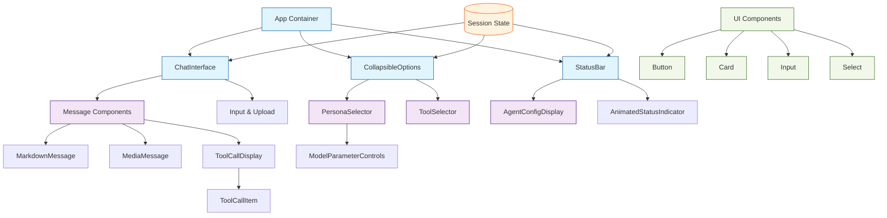

```mermaid
graph TD
    %% Main Container and Core Components
    App[App Container] --> Chat[ChatInterface]
    App --> Status[StatusBar]
    App --> Options[CollapsibleOptions]
    
    %% Chat Interface Components
    Chat --> Messages[Message Components]
    Chat --> InputArea[Input & Upload]
    Messages --> MarkdownMsg[MarkdownMessage]
    Messages --> MediaMsg[MediaMessage]
    Messages --> ToolCall[ToolCallDisplay]
    ToolCall --> ToolItem[ToolCallItem]
    
    %% Options Panel Components
    Options --> PersonaSel[PersonaSelector]
    Options --> ToolSel[ToolSelector]
    PersonaSel --> ModelParams[ModelParameterControls]
    
    %% Status Components
    Status --> AgentConfig[AgentConfigDisplay]
    Status --> AnimStatus[AnimatedStatusIndicator]
    
    %% Shared State and Data Flow
    State[(Session State)] --> Chat
    State --> Status
    State --> Options
    
    %% UI Components
    UI[UI Components] --> Button
    UI --> Card
    UI --> Input
    UI --> Select
    
    %% Style Definitions
    classDef container fill:#e1f5fe,stroke:#01579b
    classDef component fill:#f3e5f5,stroke:#4a148c
    classDef state fill:#fff3e0,stroke:#e65100
    classDef ui fill:#f1f8e9,stroke:#33691e
    
    %% Apply Styles
    class App,Chat,Options,Status container
    class Messages,PersonaSel,ToolSel,AgentConfig component
    class State state
    class UI,Button,Card,Input,Select ui
```