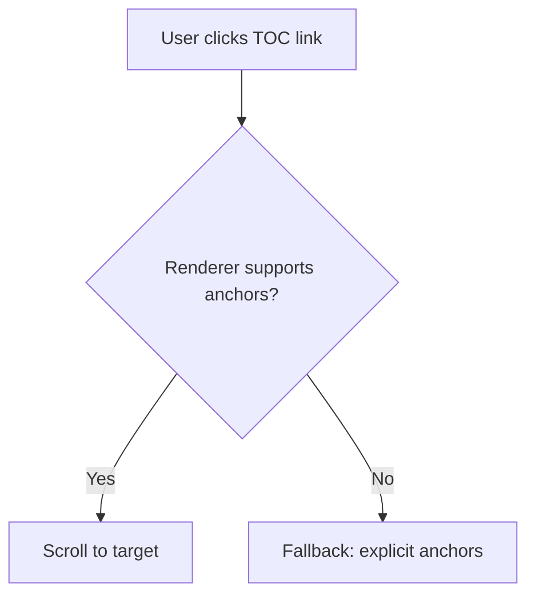

# Test Markdown: Anchors + Code Blocks <a id="top"></a>

A tiny file to test in-document anchor links and code fences.

## Table of Contents
- [Overview](#overview)
- [Mermaid Diagram](#mermaid-diagram)
- [Python Example](#python-example)
- [C# Example](#csharp-example)
- [Edge-Case Heading: Emoji & Punctuation?!](#edge-case)

---

## 1. 📚 Overview <a id="overview"></a>
This section exists to confirm anchor navigation works.
- and we'll put in an external link to [Google](https://www.google.com) for good measure.
- Other bullet points to test rendering.


[⬆ Back to Top](#top)

---

## 2. 🗺️ Mermaid Diagram <a id="mermaid-diagram"></a>


[⬆ Back to Top](#top)

## 3. 🐍 Python Example <a id="python-example"></a>
```python
def greet(name: str) -> str:
    """Return a friendly greeting."""
    return f"Hello, {name}! Anchors and code look good."

if __name__ == "__main__":
    print(greet("Tester"))
```
[⬆ Back to Top](#top)

## 🧩 4. C# Example <a id="csharp-example"></a>
```csharp
using System;
using System.Linq;

class Program
{
    static void Main()
    {
        var nums = new[] { 1, 2, 3, 4, 5 };
        var evens = nums.Where(n => n % 2 == 0).ToList();
        Console.WriteLine($"Evens: {string.Join(", ", evens)}");
    }
}
```
[⬆ Back to Top](#top)

## 5. 🔗 Edge-Case Heading: Emoji & Punctuation?! <a id="edge-case"></a>
This section tests edge-case headings with emojis and punctuation.