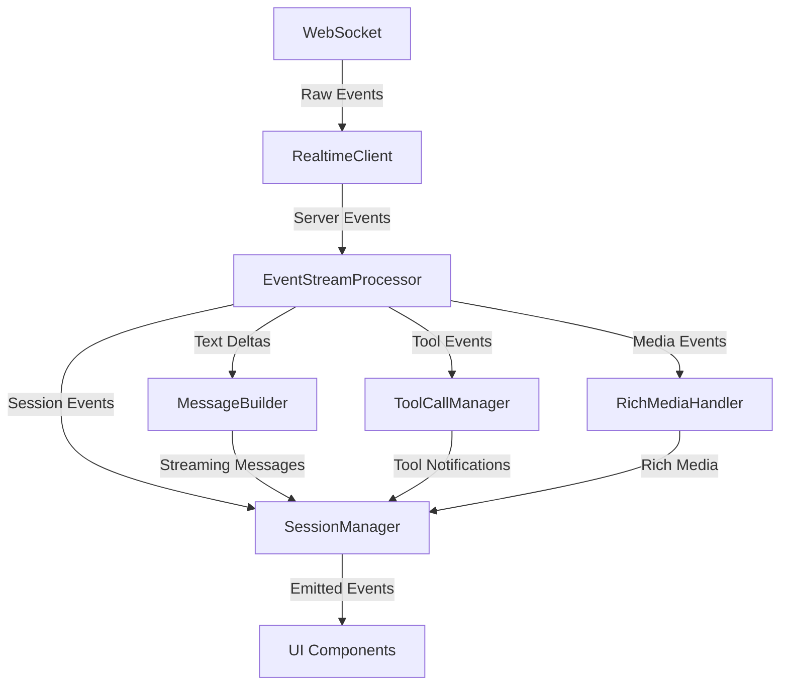

# EventStreamProcessor API Documentation

## Overview

The `EventStreamProcessor` class is the central orchestrator of the Agent C Realtime SDK's event processing pipeline. It serves as the main hub that receives raw server events from the WebSocket connection and intelligently routes them to specialized handlers while coordinating the complex interactions between message building, tool execution, rich media rendering, and session management.

### Purpose

EventStreamProcessor acts as the event processing brain of the SDK that:
- Routes incoming server events to appropriate specialized handlers
- Orchestrates MessageBuilder for streaming text accumulation
- Manages ToolCallManager for tool execution lifecycle
- Coordinates RichMediaHandler for media content processing
- Maintains SessionManager state with processed messages
- Handles sub-session detection and agent delegation tracking
- Normalizes message formats across different AI vendors (Anthropic, OpenAI)
- Manages the complete lifecycle of streaming interactions

### Architecture Context

EventStreamProcessor sits at the heart of the event processing pipeline:
- **RealtimeClient**: Receives raw WebSocket events and delegates to EventStreamProcessor
- **MessageBuilder**: Handles streaming text accumulation under EventStreamProcessor's direction
- **ToolCallManager**: Tracks tool execution state as directed by EventStreamProcessor
- **RichMediaHandler**: Processes media content when EventStreamProcessor encounters render_media events
- **SessionManager**: Receives processed messages and state updates from EventStreamProcessor

## Class Definition

```typescript
export class EventStreamProcessor {
  constructor(sessionManager: SessionManager)
  
  // Core event processing
  processEvent(event: ServerEvent): void
  
  // Session management
  setUserSessionId(id: string): void
  
  // State management
  reset(): void
  destroy(): void
}
```

## Event Processing Pipeline

### Event Flow Architecture



### Supported Event Types

EventStreamProcessor handles the following server event types:

| Event Type | Handler | Description |
|------------|---------|-------------|
| `interaction` | handleInteraction | Manages interaction lifecycle |
| `text_delta` | handleTextDelta | Processes streaming text chunks |
| `thought_delta` | handleThoughtDelta | Handles agent thinking streams |
| `completion` | handleCompletion | Finalizes messages with metadata |
| `tool_select_delta` | handleToolSelect | Tool selection notifications |
| `tool_call` | handleToolCall | Tool execution tracking |
| `render_media` | handleRenderMedia | Rich media content processing |
| `system_message` | handleSystemMessage | System notifications |
| `error` | handleError | Error event handling |
| `history_delta` | handleHistoryDelta | Incremental history updates |
| `chat_session_changed` | handleChatSessionChanged | Session switching/resuming |
| `user_message` | handleUserMessage | User message processing |
| `anthropic_user_message` | handleAnthropicUserMessage | Anthropic-specific messages |
| `subsession_started` | handleSubsessionStarted | Agent delegation tracking |
| `subsession_ended` | handleSubsessionEnded | Delegation completion |
| `cancelled` | handleCancelled | Response cancellation |

### Ignored Event Types

The following events are intentionally ignored as they're handled elsewhere:
- `history` - Full history is handled separately
- `history_delta` - Incremental updates managed by SessionManager
- `complete_thought` - Redundant with thought_delta completion
- `system_prompt` - Internal server configuration

## Method Details

### constructor(sessionManager: SessionManager)

Creates a new EventStreamProcessor with required dependencies.

**Parameters:**
- `sessionManager`: The SessionManager instance for state management

**Initialization:**
- Creates MessageBuilder instance for text accumulation
- Creates ToolCallManager for tool state tracking
- Creates RichMediaHandler for media processing
- Stores SessionManager reference for event emission

**Example:**
```typescript
const sessionManager = new SessionManager();
const processor = new EventStreamProcessor(sessionManager);
```

### processEvent(event: ServerEvent): void

Main event processing entry point that routes events to appropriate handlers.

**Parameters:**
- `event`: Server event to process

**Behavior:**
1. Filters out ignored event types early
2. Routes to specific handler based on event.type
3. Maintains processing order for dependent events
4. Logs unhandled event types for debugging

**Example:**
```typescript
processor.processEvent({
  type: 'text_delta',
  content: 'Hello ',
  session_id: 'session_123'
});
```

### setUserSessionId(id: string): void

Sets the user session ID for sub-session detection.

**Parameters:**
- `id`: The primary user session ID

**Purpose:**
- Enables detection of agent delegation (sub-sessions)
- Distinguishes between user session and delegated agent sessions
- Adds metadata to messages from sub-sessions

**Example:**
```typescript
processor.setUserSessionId('user_session_456');
// Now processor can detect when events come from delegated agents
```

### reset(): void

Resets all internal state for a clean slate.

**Behavior:**
- Resets MessageBuilder state
- Clears ToolCallManager tracking
- Prepares for new interaction

**Example:**
```typescript
processor.reset();
// Ready for new conversation
```

### destroy(): void

Cleans up resources and prepares for disposal.

**Behavior:**
- Calls reset() to clear state
- Releases all handler references
- Prepares for garbage collection

**Example:**
```typescript
processor.destroy();
// Processor is now disposed
```

## Event Handler Details

### Text Delta Handling

Manages streaming text accumulation:

```typescript
private handleTextDelta(event: TextDeltaEvent): void {
  // Start new message if needed
  if (!this.messageBuilder.hasCurrentMessage()) {
    this.messageBuilder.startMessage('assistant');
  }
  
  // Append text delta
  this.messageBuilder.appendText(event.content);
  
  // Emit streaming update
  const currentMessage = this.messageBuilder.getCurrentMessage();
  if (currentMessage) {
    this.sessionManager.emit('message-streaming', {
      sessionId: event.session_id,
      message: currentMessage
    });
  }
}
```

### Thought Delta Handling

Special handling for agent thinking processes:

```typescript
private handleThoughtDelta(event: ThoughtDeltaEvent): void {
  // Ensure we're building a thought message
  if (!this.messageBuilder.hasCurrentMessage() || 
      this.messageBuilder.getCurrentMessageType() !== 'thought') {
    // Finalize any regular message first
    if (this.messageBuilder.hasCurrentMessage()) {
      const message = this.messageBuilder.finalize();
      this.sessionManager.emit('message-complete', { message });
    }
    this.messageBuilder.startMessage('thought');
    
    // Remove "Agent is thinking..." notifications
    this.removeThinkingNotifications();
  }
  
  // Append thought content
  this.messageBuilder.appendText(event.content);
  
  // Emit streaming update
  this.emitStreamingUpdate(event.session_id);
}
```

### Completion Handling

Finalizes messages with complete metadata:

```typescript
private handleCompletion(event: CompletionEvent): void {
  if (!event.running && this.messageBuilder.hasCurrentMessage()) {
    // Gather tool information
    const toolCalls = this.toolCallManager.getCompletedToolCalls();
    
    // Finalize with metadata
    const message = this.messageBuilder.finalize({
      inputTokens: event.input_tokens,
      outputTokens: event.output_tokens,
      stopReason: event.stop_reason,
      toolCalls: extractToolCalls(toolCalls),
      toolResults: extractToolResults(toolCalls)
    });
    
    // Update session
    this.updateSessionWithMessage(message);
    
    // Emit completion
    this.sessionManager.emit('message-complete', {
      sessionId: event.session_id,
      message
    });
    
    // Reset for next message
    this.messageBuilder.reset();
  }
}
```

### Tool Call Management

Coordinates tool execution lifecycle:

```typescript
private handleToolSelect(event: ToolSelectDeltaEvent): void {
  const notification = this.toolCallManager.onToolSelect(event);
  
  // Special handling for "think" tool
  if (event.tool_calls[0]?.name === 'think') {
    this.sessionManager.emit('tool-notification', {
      ...notification,
      toolName: 'think',
      status: 'preparing'
    });
  } else {
    this.sessionManager.emit('tool-notification', notification);
  }
}

private handleToolCall(event: ToolCallEvent): void {
  // Skip "think" tool as it's rendered via thought deltas
  if (event.tool_calls[0]?.name === 'think') {
    this.sessionManager.emit('tool-notification-removed', 
                            event.tool_calls[0].id);
    return;
  }
  
  if (event.active) {
    // Tool executing
    const notification = this.toolCallManager.onToolCallActive(event);
    if (notification) {
      this.sessionManager.emit('tool-notification', notification);
    }
  } else {
    // Tool completed
    this.toolCallManager.onToolCallComplete(event);
    this.sessionManager.emit('tool-call-complete', {
      toolCalls: event.tool_calls,
      toolResults: event.tool_results
    });
    
    // Remove notifications
    this.removeToolNotifications(event.tool_calls);
  }
}
```

## Message Format Normalization

### Content Normalization

EventStreamProcessor normalizes different message formats into a consistent structure:

```typescript
private normalizeMessageContent(content: string | ContentBlockParam[]): MessageContent {
  // Handle simple string content
  if (typeof content === 'string') {
    return content;
  }
  
  // Handle array of content blocks
  if (Array.isArray(content)) {
    // Check if all blocks are text - concatenate for proper markdown
    const allTextBlocks = content.every(block => isTextBlockParam(block));
    
    if (allTextBlocks) {
      return content
        .filter(isTextBlockParam)
        .map(block => block.text)
        .join('');
    }
    
    // Convert mixed content to ContentPart[]
    return this.convertContentBlocks(content);
  }
  
  return '';
}
```

### Vendor Message Handling

Handles vendor-specific message formats:

```typescript
private handleAnthropicUserMessage(event: AnthropicUserMessageEvent): void {
  // Convert Anthropic format to normalized Message
  const message = this.convertMessageParam(event.message);
  
  // Check for sub-session
  if (this.isSubSession(event)) {
    message.isSubSession = true;
    message.metadata = {
      sessionId: event.session_id,
      parentSessionId: event.parent_session_id,
      userSessionId: event.user_session_id
    };
  }
  
  // Add to session and emit
  this.addMessageToSession(message);
  this.sessionManager.emit('message-added', { message });
}
```

## Sub-Session Detection

EventStreamProcessor tracks agent delegation through sub-session detection:

```typescript
private isSubSession(event: any): boolean {
  // Primary check: use event fields
  if (event.user_session_id && event.session_id) {
    return event.session_id !== event.user_session_id;
  }
  
  // Fallback: use stored user session ID
  if (this.userSessionId && event.session_id) {
    return event.session_id !== this.userSessionId;
  }
  
  return false;
}
```

## Integration with RealtimeClient

RealtimeClient delegates specific events to EventStreamProcessor:

```typescript
// In RealtimeClient WebSocket message handler
const eventTypesToProcess = [
  'interaction',
  'text_delta',
  'thought_delta',
  'completion',
  'tool_select_delta',
  'tool_call',
  'render_media',
  'system_message',
  'error',
  'history_delta',
  'chat_session_changed',
  'user_message',
  'anthropic_user_message',
  'subsession_started',
  'subsession_ended',
  'cancelled'
];

if (eventTypesToProcess.includes(event.type)) {
  this.eventStreamProcessor.processEvent(event);
  processedByEventStream = true;
}

// EventStreamProcessor handles its own event emission
if (!processedByEventStream) {
  this.emit(event.type, event);
}
```

## Event Emission Patterns

### Streaming Events

EventStreamProcessor emits various events for UI consumption:

```typescript
// Message streaming
this.sessionManager.emit('message-streaming', {
  sessionId: string,
  message: Partial<EnhancedMessage>
});

// Message completion
this.sessionManager.emit('message-complete', {
  sessionId: string,
  message: EnhancedMessage
});

// Tool notifications
this.sessionManager.emit('tool-notification', {
  id: string,
  toolName: string,
  status: 'preparing' | 'executing' | 'complete',
  timestamp: Date,
  arguments?: string
});

// System notifications
this.sessionManager.emit('system-notification', {
  type: 'system' | 'error',
  severity: 'info' | 'warning' | 'error',
  content: string,
  timestamp: string,
  source?: string
});
```

### Session Events

```typescript
// Session messages loaded
this.sessionManager.emit('session-messages-loaded', {
  sessionId: string,
  messages: Message[]
});

// Message added to session
this.sessionManager.emit('message-added', {
  sessionId: string,
  message: Message
});

// Sessions updated
this.sessionManager.emit('sessions-updated', {
  sessions: ChatSession[]
});
```

## Error Handling and Recovery

### Interrupted Streams

EventStreamProcessor gracefully handles interruptions:

```typescript
private handleCancelled(event: CancelledEvent): void {
  // Finalize any in-progress message
  if (this.messageBuilder.hasCurrentMessage()) {
    const message = this.messageBuilder.finalize({
      stopReason: 'cancelled'
    });
    
    this.addMessageToSession(message);
    this.sessionManager.emit('message-complete', {
      sessionId: session?.session_id || '',
      message
    });
  }
  
  // Clear active tool notifications
  this.clearActiveNotifications();
  
  // Reset state
  this.messageBuilder.reset();
  this.toolCallManager.reset();
  
  // Notify UI
  this.sessionManager.emit('response-cancelled', {});
}
```

### Malformed Event Handling

Defensive programming for edge cases:

```typescript
// Auto-start message if text delta arrives without active message
if (!this.messageBuilder.hasCurrentMessage()) {
  Logger.warn('[EventStreamProcessor] Text delta without active message');
  this.messageBuilder.startMessage('assistant');
}

// Handle missing message content
if (!event.message) {
  Logger.warn('[EventStreamProcessor] User message missing content');
  message = {
    role: 'user',
    content: '[User message]',
    timestamp: new Date().toISOString(),
    format: 'text'
  };
}
```

## Usage Examples

### Basic Integration

```typescript
import { RealtimeClient } from '@agentc/realtime-core';
import { SessionManager } from '@agentc/realtime-core';
import { EventStreamProcessor } from '@agentc/realtime-core';

// Setup
const sessionManager = new SessionManager();
const processor = new EventStreamProcessor(sessionManager);

// Listen for processed events
sessionManager.on('message-streaming', ({ message }) => {
  updateChatUI(message);
});

sessionManager.on('message-complete', ({ message }) => {
  addToChatHistory(message);
});

sessionManager.on('tool-notification', (notification) => {
  showToolIndicator(notification);
});
```

### Custom Event Processing

```typescript
class ExtendedEventProcessor extends EventStreamProcessor {
  constructor(sessionManager: SessionManager) {
    super(sessionManager);
  }
  
  processEvent(event: ServerEvent): void {
    // Add custom pre-processing
    if (event.type === 'custom_event') {
      this.handleCustomEvent(event);
      return;
    }
    
    // Delegate to parent
    super.processEvent(event);
    
    // Add custom post-processing
    this.logEventMetrics(event);
  }
  
  private handleCustomEvent(event: any): void {
    // Custom event handling
    this.sessionManager.emit('custom-processed', {
      eventType: event.type,
      processed: true
    });
  }
  
  private logEventMetrics(event: ServerEvent): void {
    // Track metrics
    metrics.increment(`events.${event.type}`);
  }
}
```

### Sub-Session Tracking

```typescript
// Track agent delegation
processor.setUserSessionId('primary_session_123');

sessionManager.on('subsession-started', (event) => {
  console.log(`Agent delegated to: ${event.subAgentKey}`);
  showDelegationIndicator(event.subAgentType);
});

sessionManager.on('message-added', ({ message }) => {
  if (message.isSubSession) {
    // Show differently in UI
    renderDelegatedMessage(message);
  } else {
    renderNormalMessage(message);
  }
});

sessionManager.on('subsession-ended', () => {
  hideDelegationIndicator();
});
```

### Complete Chat Implementation

```typescript
class ChatController {
  private processor: EventStreamProcessor;
  private sessionManager: SessionManager;
  private messages: Message[] = [];
  private streamingMessage: Partial<Message> | null = null;
  
  constructor() {
    this.sessionManager = new SessionManager();
    this.processor = new EventStreamProcessor(this.sessionManager);
    this.setupListeners();
  }
  
  private setupListeners(): void {
    // Handle streaming updates
    this.sessionManager.on('message-streaming', ({ message }) => {
      this.streamingMessage = message;
      this.renderMessages();
    });
    
    // Handle completed messages
    this.sessionManager.on('message-complete', ({ message }) => {
      this.messages.push(message);
      this.streamingMessage = null;
      this.renderMessages();
    });
    
    // Handle session changes
    this.sessionManager.on('session-messages-loaded', ({ messages }) => {
      this.messages = messages;
      this.streamingMessage = null;
      this.renderMessages();
    });
    
    // Handle tool execution
    this.sessionManager.on('tool-notification', (notification) => {
      this.showToolStatus(notification);
    });
    
    this.sessionManager.on('tool-notification-removed', (id) => {
      this.removeToolStatus(id);
    });
    
    // Handle errors
    this.sessionManager.on('system-notification', (notification) => {
      if (notification.severity === 'error') {
        this.showError(notification.content);
      } else {
        this.showInfo(notification.content);
      }
    });
  }
  
  public processIncomingEvent(event: ServerEvent): void {
    this.processor.processEvent(event);
  }
  
  public reset(): void {
    this.processor.reset();
    this.messages = [];
    this.streamingMessage = null;
  }
  
  private renderMessages(): void {
    // Render all completed messages plus streaming
    const allMessages = [...this.messages];
    if (this.streamingMessage) {
      allMessages.push(this.streamingMessage as Message);
    }
    
    updateChatDisplay(allMessages);
  }
  
  private showToolStatus(notification: ToolNotification): void {
    // Show tool execution indicator
    updateToolIndicator(notification);
  }
  
  private removeToolStatus(id: string): void {
    // Remove tool indicator
    removeToolIndicator(id);
  }
  
  private showError(message: string): void {
    showErrorBanner(message);
  }
  
  private showInfo(message: string): void {
    showInfoToast(message);
  }
}
```

## Best Practices

### 1. Always Use SessionManager for Event Emission

```typescript
// ✅ Correct - emit through SessionManager
this.sessionManager.emit('message-complete', { message });

// ❌ Wrong - don't emit directly
this.emit('message-complete', { message });
```

### 2. Handle Event Processing Order

```typescript
// Process dependent events in order
processEvent(event: ServerEvent): void {
  // Completion must be after all deltas
  if (event.type === 'completion') {
    this.flushPendingDeltas();
  }
  
  // Route to handler
  this.routeEvent(event);
  
  // Post-processing
  if (event.type === 'completion') {
    this.cleanupAfterCompletion();
  }
}
```

### 3. Normalize Content Consistently

```typescript
// Always normalize content for UI compatibility
const normalizedContent = this.normalizeMessageContent(rawContent);

// Don't pass raw Anthropic/OpenAI formats to UI
// ❌ Wrong
message.content = event.message.content;

// ✅ Correct
message.content = this.normalizeMessageContent(event.message.content);
```

### 4. Track Sub-Sessions Properly

```typescript
// Set user session ID early
client.on('connected', ({ sessionId }) => {
  processor.setUserSessionId(sessionId);
});

// Check sub-session on relevant events
if (this.isSubSession(event)) {
  // Add metadata for UI differentiation
  message.metadata = {
    isSubSession: true,
    parentSession: this.userSessionId
  };
}
```

### 5. Clean Up on Cancellation

```typescript
private handleCancelled(): void {
  // Always finalize in-progress work
  this.finalizeCurrentMessage();
  
  // Clear all temporary state
  this.clearActiveNotifications();
  this.resetAllHandlers();
  
  // Notify UI of cancellation
  this.emitCancellationEvents();
}
```

### 6. Coordinate Handler State

```typescript
// Ensure handlers are in sync
private handleCompletion(event: CompletionEvent): void {
  // Get tool state before clearing
  const toolCalls = this.toolCallManager.getCompletedToolCalls();
  
  // Finalize message with tool data
  const message = this.messageBuilder.finalize({
    toolCalls: toolCalls
  });
  
  // Clear tool state after using it
  this.toolCallManager.clearCompleted();
  
  // Reset message builder for next message
  this.messageBuilder.reset();
}
```

### 7. Log Processing Flow

```typescript
processEvent(event: ServerEvent): void {
  const startTime = performance.now();
  
  Logger.debug(`[EventStreamProcessor] Processing: ${event.type}`);
  
  try {
    this.routeEvent(event);
    
    const duration = performance.now() - startTime;
    Logger.debug(`[EventStreamProcessor] Processed ${event.type} in ${duration}ms`);
  } catch (error) {
    Logger.error(`[EventStreamProcessor] Failed to process ${event.type}:`, error);
    
    // Emit error but continue processing
    this.sessionManager.emit('processing-error', {
      eventType: event.type,
      error: error.message
    });
  }
}
```

## Performance Considerations

### Event Filtering

EventStreamProcessor filters ignored events early to avoid unnecessary processing:

```typescript
const IGNORED_EVENTS = ['history', 'history_delta', 'complete_thought', 'system_prompt'];

if (IGNORED_EVENTS.includes(event.type)) {
  Logger.debug(`[EventStreamProcessor] Ignoring event type: ${event.type}`);
  return; // Early return saves processing
}
```

### Handler Delegation

Each handler is optimized for its specific event type:
- Text deltas: Minimal processing, direct append
- Tool calls: State tracking without heavy computation
- Rich media: Validation without sanitization (done in UI layer)
- Session changes: Batch updates when possible

### Memory Management

```typescript
// Clear completed tool calls after use
this.toolCallManager.clearCompleted();

// Reset builders after completion
this.messageBuilder.reset();

// Don't accumulate unlimited history
if (session.messages.length > MAX_MESSAGES) {
  session.messages = session.messages.slice(-MAX_MESSAGES);
}
```

## Testing Considerations

### Unit Testing

```typescript
describe('EventStreamProcessor', () => {
  let processor: EventStreamProcessor;
  let sessionManager: SessionManager;
  
  beforeEach(() => {
    sessionManager = new SessionManager();
    processor = new EventStreamProcessor(sessionManager);
    jest.spyOn(sessionManager, 'emit');
  });
  
  describe('Text Delta Processing', () => {
    it('should accumulate text deltas', () => {
      processor.processEvent({
        type: 'text_delta',
        content: 'Hello ',
        session_id: 'test'
      });
      
      processor.processEvent({
        type: 'text_delta',
        content: 'world',
        session_id: 'test'
      });
      
      expect(sessionManager.emit).toHaveBeenCalledWith(
        'message-streaming',
        expect.objectContaining({
          message: expect.objectContaining({
            content: 'Hello world'
          })
        })
      );
    });
  });
  
  describe('Completion Processing', () => {
    it('should finalize message on completion', () => {
      // Start message
      processor.processEvent({
        type: 'text_delta',
        content: 'Complete message',
        session_id: 'test'
      });
      
      // Complete it
      processor.processEvent({
        type: 'completion',
        running: false,
        session_id: 'test',
        output_tokens: 5,
        stop_reason: 'stop'
      });
      
      expect(sessionManager.emit).toHaveBeenCalledWith(
        'message-complete',
        expect.objectContaining({
          message: expect.objectContaining({
            content: 'Complete message',
            status: 'complete',
            metadata: expect.objectContaining({
              outputTokens: 5,
              stopReason: 'stop'
            })
          })
        })
      );
    });
  });
  
  describe('Sub-session Detection', () => {
    it('should detect sub-sessions', () => {
      processor.setUserSessionId('user_123');
      
      processor.processEvent({
        type: 'anthropic_user_message',
        session_id: 'sub_456',
        user_session_id: 'user_123',
        message: { role: 'user', content: 'Test' }
      });
      
      expect(sessionManager.emit).toHaveBeenCalledWith(
        'message-added',
        expect.objectContaining({
          message: expect.objectContaining({
            isSubSession: true
          })
        })
      );
    });
  });
});
```

### Integration Testing

```typescript
describe('EventStreamProcessor Integration', () => {
  it('should handle complete interaction flow', async () => {
    const sessionManager = new SessionManager();
    const processor = new EventStreamProcessor(sessionManager);
    const messages: Message[] = [];
    
    sessionManager.on('message-complete', ({ message }) => {
      messages.push(message);
    });
    
    // Simulate complete interaction
    processor.processEvent({ type: 'interaction', started: true, id: '1' });
    processor.processEvent({ type: 'text_delta', content: 'Hello', session_id: 's1' });
    processor.processEvent({ type: 'text_delta', content: ' there', session_id: 's1' });
    processor.processEvent({ type: 'completion', running: false, session_id: 's1' });
    processor.processEvent({ type: 'interaction', started: false, id: '1' });
    
    expect(messages).toHaveLength(1);
    expect(messages[0].content).toBe('Hello there');
    expect(messages[0].status).toBe('complete');
  });
});
```

## Troubleshooting Guide

### Common Issues

#### Messages Not Appearing
- Verify EventStreamProcessor is receiving events
- Check SessionManager event listeners are registered
- Ensure completion event is being sent
- Verify message normalization isn't failing

#### Tool Notifications Stuck
- Check tool_call events have active: false to complete
- Verify tool IDs match between select and call events
- Ensure notifications are being removed on completion

#### Sub-Sessions Not Detected
- Call setUserSessionId with primary session ID
- Verify events include user_session_id field
- Check session_id differs from user_session_id

#### Thought Deltas Not Showing
- Verify thought messages are handled separately from regular messages
- Check "think" tool notifications are being removed
- Ensure UI supports thought message type

## Summary

EventStreamProcessor is the critical orchestration layer that transforms raw WebSocket events into structured, normalized data for the UI layer. It coordinates multiple specialized handlers (MessageBuilder, ToolCallManager, RichMediaHandler) while maintaining session state through SessionManager. Its responsibilities include:

1. **Event Routing**: Intelligently routes 15+ event types to appropriate handlers
2. **Message Building**: Orchestrates streaming text accumulation and finalization
3. **Tool Management**: Tracks tool execution lifecycle from selection to completion
4. **Format Normalization**: Converts vendor-specific formats to consistent UI-ready structures
5. **Sub-Session Detection**: Identifies and tracks agent delegation for proper attribution
6. **State Coordination**: Ensures all handlers work in harmony without conflicts
7. **Error Recovery**: Gracefully handles interruptions, cancellations, and malformed events

The class exemplifies good separation of concerns by delegating specific responsibilities to specialized handlers while maintaining overall coordination and state consistency. This architecture enables the SDK to handle complex real-time interactions while providing a clean, consistent event stream to the UI layer.