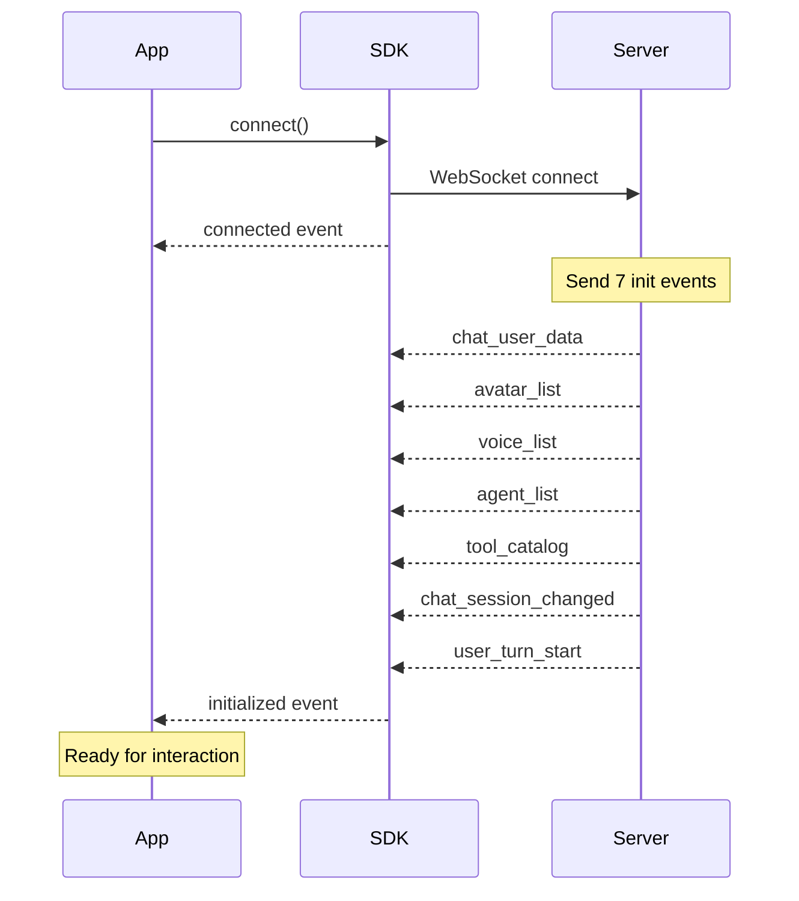
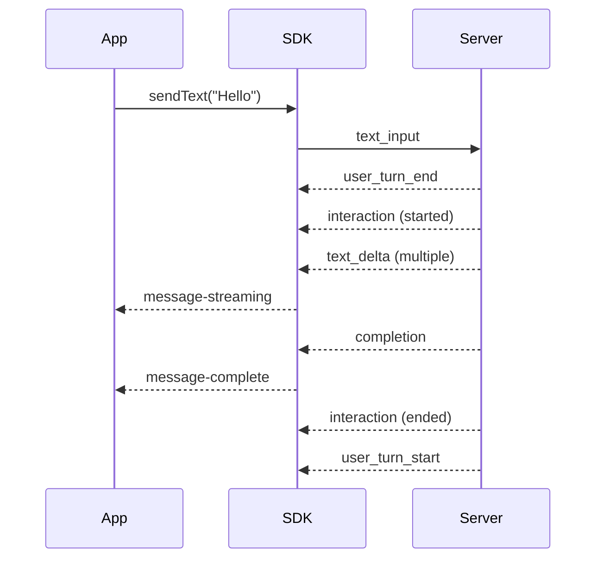

# Event System API Reference

## Overview

The Agent C Realtime SDK uses a comprehensive event-driven architecture. All data flows through events, from authentication and initialization to real-time chat interactions and audio streaming.

## Event Architecture

The SDK handles three types of events:

1. **Server Events** - Events sent from the Agent C Realtime API to the client
2. **Client Events** - Commands sent from the client to control the server
3. **SDK Events** - Events emitted locally by the SDK for application use

## Server → Client Events

These events are sent from the Agent C Realtime API to update the client. They follow the BaseEvent/SessionEvent inheritance model.

### Control Events (BaseEvent)

Control events manage system configuration and session lifecycle. They inherit directly from BaseEvent.

#### Initialization Events (Auto-sent on connect)

The server automatically sends a series initialization events in sequence immediately after WebSocket connection, the current list is as follows:

| Event                  | Description                               | Payload                         |
|------------------------|-------------------------------------------|---------------------------------|
| `chat_user_data`       | User profile information                  | `{ user: User }`                |
| `avatar_list`          | Available HeyGen avatars                  | `{ avatars: Avatar[] }`         |
| `voice_list`           | Available TTS voices                      | `{ voices: Voice[] }`           |
| `agent_list`           | Available AI agents                       | `{ agents: Agent[] }`           |
| `tool_catalog`         | Available agent tools                     | `{ tools: Tool[] }`             |
| `chat_session_changed` | Current chat session                      | `{ chat_session: ChatSession }` |
| `user_turn_start`      | **READY SIGNAL** - Server ready for input | `{}`                            |

**⚠️ IMPORTANT:** Clients MUST wait for `user_turn_start` before sending any input (text or audio).

#### Agent Events

| Event                         | Description          | Payload                                |
|-------------------------------|----------------------|----------------------------------------|
| `agent_configuration_changed` | Agent config updated | `{ agent_config: AgentConfiguration }` |

#### Avatar Events

| Event                       | Description                   | Payload                                                                           |
|-----------------------------|-------------------------------|-----------------------------------------------------------------------------------|
| `avatar_connection_changed` | Avatar session status changed | `{ avatar_session_request: AvatarSessionRequest, avatar_session: AvatarSession }` |

#### Session Management Events

| Event                        | Description                      | Payload                                         |
|------------------------------|----------------------------------|-------------------------------------------------|
| `chat_session_name_changed`  | Session renamed                  | `{ session_name: string, session_id?: string }` |
| `session_metadata_changed`   | Metadata updated                 | `{ meta: Record<string, any> }`                 |
| `chat_session_added`         | New session created              | `{ chat_session: ChatSessionIndexEntry }`       |
| `chat_session_deleted`       | Session deleted                  | `{ session_id?: string }`                       | 
| `get_user_sessions_response` | Response to session list request | `{ sessions: ChatSessionQueryResponse }`        |

#### Voice Events

| Event                   | Description                | Payload                           |
|-------------------------|----------------------------|-----------------------------------|
| `agent_voice_changed`   | Agent's TTS voice changed  | `{ voice: Voice }`                |
| `voice_input_supported` | Supported input modes      | `{ modes: ('ptt' \| 'vad')[] }`   |
| `server_listening`      | Server listening for audio | `{}`                              |

#### Connection Events

| Event       | Description                     | Payload                                |
|-------------|---------------------------------|----------------------------------------|
| `pong`      | Response to ping                | `{}`                                   |
| `error`     | Error notification              | `{ message: string, source?: string }` |
| `cancelled` | Response cancelled confirmation | `{}`                                   |

### Session Events (SessionEvent)

Session events are generated during chat interactions and include session context fields:
- `session_id` - Current chat session ID
- `role` - Role that triggered the event
- `parent_session_id` - Parent session ID (if nested)
- `user_session_id` - Top-level user session ID (if nested)

#### Message Streaming Events

| Event           | Description                  | Payload                                                       |
|-----------------|------------------------------|---------------------------------------------------------------|
| `text_delta`    | Streaming assistant text     | `{ content: string, format: MessageFormat }` + session fields |
| `thought_delta` | Streaming assistant thoughts | `{ content: string, format: MessageFormat }` + session fields |
| `history_delta` | Incremental history update   | `{ messages: Message[] }` + session fields                    |

#### Completion Events

| Event          | Description           | Payload                                                                                                                                                 |
|----------------|-----------------------|---------------------------------------------------------------------------------------------------------------------------------------------------------|
| `completion`   | Generation status     | `{ running: boolean, completion_options: CompletionOptions, stop_reason?: StopReason, input_tokens?: number, output_tokens?: number }` + session fields |
| `interaction`  | Interaction lifecycle | `{ started: boolean, id: string }` + session fields                                                                                                     |

#### History Events

| Event                    | Description                  | Payload                                                       |
|--------------------------|------------------------------|---------------------------------------------------------------|
| `history`                | Full message history         | `{ vendor: string, messages: Message[] }` + session fields    |
| `system_prompt`          | System instructions          | `{ content: string, format: MessageFormat }` + session fields |
| `user_request`           | User input echo              | `{ data: { message: string } }` + session fields              |
| `user_message`           | Vendor-specific user message | `{ vendor: string, message?: any }` + session fields          |
| `anthropic_user_message` | Anthropic user message       | `{ vendor: 'anthropic', message: any }` + session fields      |
| `openai_user_message`    | OpenAI user message          | `{ vendor: 'openai', message: any }` + session fields         |

#### Tool Events

| Event               | Description             | Payload                                                                                                              |
|---------------------|-------------------------|----------------------------------------------------------------------------------------------------------------------|
| `tool_select_delta` | Tool being selected     | `{ tool_calls: ToolCall[] }` + session fields                                                                        |
| `tool_call`         | Tool execution          | `{ active: boolean, vendor: string, tool_calls: ToolCall[], tool_results?: ToolResult[] }` + session fields          |


**IMPORTANT**: Sequence of events for fool calls is `tool_select_delta` → `tool_call` (active: true) → `tool_call` (active: false). The final event contains the results.


### Content Rendering Events

| Event               | Description             | Payload                                                                                                              |
|---------------------|-------------------------|----------------------------------------------------------------------------------------------------------------------|
| `render_media`      | Media content           | `{ content_type: string, content: string, foreign_content: boolean, url?: string, name?: string }` + session fields  |

**⚠️ SECURITY:** The `foreign_content` field in `render_media` indicates untrusted third-party content requiring sandboxing.


#### System Events

| Event                | Description            | Payload                                                                                                                 |
|----------------------|------------------------|-------------------------------------------------------------------------------------------------------------------------|
| `system_message`     | System notification    | `{ content: string, format: MessageFormat, severity?: Severity }` + session fields                                      |
| `subsession_started` | Nested session started | `{ sub_session_type: string, sub_agent_type: string, prime_agent_key: string, sub_agent_key: string }` + session fields |
| `subsession_ended`   | Nested session ended   | `{}` + session fields                                                                                                   |

### Turn Management Events

| Event             | Description                     | Payload |
|-------------------|---------------------------------|---------|
| `user_turn_start` | Server ready for user input     | `{}`    |
| `user_turn_end`   | User input received, processing | `{}`    |

## Binary Audio Frames

Binary data sent over the WebSocket is handled specially:

### Audio Output (Server → Client)
- **Format:** Raw PCM16 audio data or format specified by voice model
- **Event:** Emitted as `audio:output` in the SDK
- **Legacy Event:** Also emitted as `binary_audio` for backward compatibility

### Audio Input (Client → Server)
- **Format:** Raw PCM16 audio chunks (16-bit, mono, 16kHz recommended)
- **Method:** Send via `client.sendBinaryFrame(audioData)`
- **Processing:** Real-time speech-to-text conversion by server

## Client → Server Events

Commands sent from the client to control the server.

### Agent Management

| Event        | Description        | Payload                 |
|--------------|--------------------|-------------------------|
| `get_agents` | Request agent list | `{}`                    |
| `set_agent`  | Set active agent   | `{ agent_key: string }` |

### Avatar Management

| Event                  | Description           | Payload                                                            |
|------------------------|-----------------------|--------------------------------------------------------------------|
| `get_avatars`          | Request avatar list   | `{}`                                                               |
| `set_avatar`           | Create avatar session | `{ avatar_id: string, quality?: string, video_encoding?: string }` |
| `set_avatar_session`   | Connect to avatar     | `{ access_token: string, avatar_session_id: string }`              |
| `clear_avatar_session` | End avatar session    | `{ session_id: string }`                                           |

### Voice Management

| Event             | Description        | Payload                |
|-------------------|--------------------|------------------------|
| `get_voices`      | Request voice list | `{}`                   |
| `set_agent_voice` | Set TTS voice      | `{ voice_id: string }` |

### Chat Management

| Event                   | Description         | Payload                                         |
|-------------------------|---------------------|-------------------------------------------------|
| `text_input`            | Send text message   | `{ text: string, file_ids?: string[] }`         |
| `new_chat_session`      | Create new session  | `{ agent_key?: string }`                        |
| `resume_chat_session`   | Resume session      | `{ session_id: string }`                        |
| `set_chat_session_name` | Rename session      | `{ session_name: string, session_id?: string }` |
| `set_session_metadata`  | Update metadata     | `{ meta: Record<string, any> }`                 |
| `set_session_messages`  | Replace messages    | `{ messages: Message[] }`                       |
| `delete_chat_session`   | Delete session      | `{ session_id?: string }`                       |

### Session Management

| Event                 | Description            | Payload                               |
|-----------------------|------------------------|---------------------------------------|
| `get_user_sessions`   | Request session list   | `{ offset: number, limit: number }`   |
| `get_tool_catalog`    | Request tool catalog   | `{}`                                  |

### Audio Control

| Event                  | Description        | Payload                    |
|------------------------|--------------------|----------------------------|
| `ptt_start`            | Start push-to-talk | `{}`                       |
| `ptt_end`              | End push-to-talk   | `{}`                       |
| `set_voice_input_mode` | Set input mode     | `{ mode: 'ptt' \| 'vad' }` |

### Connection Management

| Event                 | Description             | Payload |
|-----------------------|-------------------------|---------|
| `ping`                | Health check            | `{}`    |
| `client_wants_cancel` | Cancel current response | `{}`    |

## SDK-Emitted Events

Events generated locally by the SDK for application use.

### Connection Lifecycle

| Event          | Description                        | Payload                              |
|----------------|------------------------------------|--------------------------------------|
| `connected`    | WebSocket connected                | `undefined`                          |
| `disconnected` | WebSocket disconnected             | `{ code: number, reason: string }`   |
| `reconnecting` | Attempting reconnection            | `{ attempt: number, delay: number }` |
| `reconnected`  | Successfully reconnected           | `undefined`                          |
| `initialized`  | All initialization events received | `undefined`                          |

### Session Manager Events

| Event                       | Description              | Payload                                                                 |
|-----------------------------|--------------------------|-------------------------------------------------------------------------|
| `session-changed`           | Current session changed  | `{ session: ChatSession, previousId?: string }`                         |
| `sessions-updated`          | Session list updated     | `{ sessions: ChatSession[] }`                                           |
| `sessions-index-updated`    | Session index updated    | `{ index: ChatSessionQueryResponse }`                                   |
| `message-added`             | Message added to session | `{ message: Message, sessionId: string }`                               |
| `message-streaming`         | Message being streamed   | `{ content: string, messageId: string, role: string }`                  |
| `message-complete`          | Message completed        | `{ message: Message, messageId: string }`                               |
| `tool-notification`         | Tool being executed      | `{ id: string, name: string, status: string, args?: any }`              |
| `tool-notification-removed` | Tool completed           | `string` (notification ID)                                              |
| `tool-call-complete`        | Tool call finished       | `{ toolCall: ToolCall, result?: ToolResult }`                           |
| `media-added`               | Media content added      | `{ media: RenderMediaEvent }`                                           |
| `system-notification`       | System message           | `{ message: string, severity?: string }`                                |
| `user-message`              | User message added       | `{ message: Message }`                                                  |
| `response-cancelled`        | Response was cancelled   | `{}`                                                                    |
| `session-messages-loaded`   | Messages loaded in bulk  | `{ messages: Message[], sessionId: string }`                            |
| `session-cleared`           | Session cleared          | `{ sessionId: string }`                                                 |
| `all-sessions-cleared`      | All sessions cleared     | `undefined`                                                             |
| `request-user-sessions`     | Need more sessions       | `{ offset: number, limit: number }`                                     |
| `subsession-started`        | Nested session started   | `{ type: string, agentType: string, primeKey: string, subKey: string }` |
| `subsession-ended`          | Nested session ended     | `{}`                                                                    |

### Authentication Events

| Event                   | Description         | Payload                                        |
|-------------------------|---------------------|------------------------------------------------|
| `auth:login`            | Login successful    | `{ user: User, tokens: TokenPair }`            |
| `auth:logout`           | Logout completed    | `undefined`                                    |
| `auth:tokens-refreshed` | Tokens refreshed    | `{ agentCToken: string, heygenToken: string }` |
| `auth:error`            | Auth error occurred | `{ error: Error }`                             |
| `auth:state-changed`    | Auth state changed  | `{ isAuthenticated: boolean, user?: User }`    |

### Voice Manager Events

| Event            | Description           | Payload                                                                                       |
|------------------|-----------------------|-----------------------------------------------------------------------------------------------|
| `voices-updated` | Voice list updated    | `{ voices: Voice[] }`                                                                         |
| `voice-changed`  | Current voice changed | `{ currentVoice: Voice \| null, previousVoice: Voice \| null, source: 'client' \| 'server' }` |

### Avatar Manager Events

| Event                    | Description            | Payload                                   |
|--------------------------|------------------------|-------------------------------------------|
| `avatar-session-started` | Avatar session started | `{ sessionId: string, avatarId: string }` |
| `avatar-session-ended`   | Avatar session ended   | `{ sessionId: string }`                   |
| `avatar-state-changed`   | Avatar state changed   | `{ active: boolean }`                     |

### Turn Manager Events

| Event                | Description        | Payload                     |
|----------------------|--------------------|-----------------------------|
| `turn-state-changed` | Turn state changed | `{ canSendInput: boolean }` |

### Audio Events

| Event          | Description             | Payload       |
|----------------|-------------------------|---------------|
| `audio:output` | Audio frame from server | `ArrayBuffer` |
| `binary_audio` | Legacy audio event      | `ArrayBuffer` |

## Event Sequences

### Connection and Initialization



### Message Flow



## Usage Examples

### TypeScript with RealtimeClient

```typescript
import { RealtimeClient } from '@agentc/realtime-core';

const client = new RealtimeClient(config);

// Wait for initialization
await client.connect();
await client.waitForInitialization();

// Listen to streaming text
client.on('text_delta', (event) => {
  console.log('Streaming:', event.content);
});

// Listen to audio output
client.on('audio:output', (audioData: ArrayBuffer) => {
  // Play PCM16 audio
  audioPlayer.play(audioData);
});

// Session manager events
const sessionManager = client.getSessionManager();
sessionManager?.on('message-complete', (event) => {
  console.log('Message completed:', event.message);
});

// Send text when ready
client.on('user_turn_start', () => {
  client.sendText('Hello, assistant!');
});
```

### React with Hooks

```tsx
import { useRealtimeClient, useEventListener } from '@agentc/realtime-react';

function ChatComponent() {
  const client = useRealtimeClient();
  const [messages, setMessages] = useState([]);
  
  // Listen to message completion
  useEventListener('message-complete', (event) => {
    setMessages(prev => [...prev, event.message]);
  });
  
  // Listen to streaming text
  useEventListener('message-streaming', (event) => {
    updateStreamingMessage(event.content);
  });
  
  // Listen to turn state
  useEventListener('user_turn_start', () => {
    setCanSendInput(true);
  });
  
  useEventListener('user_turn_end', () => {
    setCanSendInput(false);
  });
  
  return <ChatInterface messages={messages} />;
}
```

### Audio Streaming

```typescript
// Send audio input
const audioData = new Uint16Array(pcmBuffer);
client.sendBinaryFrame(audioData.buffer);

// Handle audio output
client.on('audio:output', (audioData: ArrayBuffer) => {
  const pcm16Data = new Int16Array(audioData);
  audioContext.playPCM16(pcm16Data);
});

// Control audio streaming
client.startAudioRecording();
client.startAudioStreaming();

// Stop when done
client.stopAudioStreaming();
client.stopAudioRecording();
```

### Cancel Response

```typescript
// Cancel the current agent response
client.cancelResponse();

// Listen for confirmation
client.on('cancelled', () => {
  console.log('Response cancelled successfully');
});

// Session manager will emit response-cancelled
sessionManager?.on('response-cancelled', () => {
  // Clean up any streaming UI
  clearStreamingMessage();
});
```

## Event Type Definitions

All event types are exported from the core package:

```typescript
import type {
  // Server events
  ChatUserDataEvent,
  VoiceListEvent,
  AgentListEvent,
  AvatarListEvent,
  ToolCatalogEvent,
  ChatSessionChangedEvent,
  TextDeltaEvent,
  ThoughtDeltaEvent,
  CompletionEvent,
  InteractionEvent,
  HistoryEvent,
  ToolCallEvent,
  ToolSelectDeltaEvent,
  RenderMediaEvent,
  SystemMessageEvent,
  UserTurnStartEvent,
  UserTurnEndEvent,
  CancelledEvent,
  
  // Client events
  TextInputEvent,
  SetAgentEvent,
  SetAvatarEvent,
  SetAvatarSessionEvent,
  NewChatSessionEvent,
  ResumeChatSessionEvent,
  ClientWantsCancelEvent,
  
  // Common types
  Voice,
  Avatar,
  Agent,
  Tool,
  Message,
  ChatSession,
  User
} from '@agentc/realtime-core';
```

## Best Practices

### 1. Wait for Initialization

```typescript
// ❌ Wrong - sending too early
client.connect();
client.sendText('Hello'); // Server not ready!

// ✅ Correct - wait for ready signal
client.connect();
await client.waitForInitialization();
client.on('user_turn_start', () => {
  client.sendText('Hello');
});
```

### 2. Handle Streaming Events

```typescript
// Use SessionManager events for message handling
const sessionManager = client.getSessionManager();

// Streaming updates
sessionManager.on('message-streaming', (event) => {
  // Update UI with partial content
  updateMessage(event.content);
});

// Final message
sessionManager.on('message-complete', (event) => {
  // Display complete message
  addMessage(event.message);
});
```

### 3. Respect Turn State

```typescript
// Use turn events to control input
let canSend = false;

client.on('user_turn_start', () => {
  canSend = true;
  enableInputUI();
});

client.on('user_turn_end', () => {
  canSend = false;
  disableInputUI();
});

function sendMessage(text: string) {
  if (!canSend) {
    console.warn('Cannot send - not user turn');
    return;
  }
  client.sendText(text);
}
```

### 4. Handle Binary Audio Properly

```typescript
// Audio output handling
client.on('audio:output', (audioData: ArrayBuffer) => {
  // Check voice model to determine format
  const voiceManager = client.getVoiceManager();
  const currentVoice = voiceManager?.getCurrentVoice();
  
  if (currentVoice?.output_format === 'pcm16') {
    // Standard PCM16 audio
    playPCM16Audio(audioData);
  }
});

// Audio input - always PCM16
const pcm16Buffer = recordAudio(); // Returns PCM16 data
client.sendBinaryFrame(pcm16Buffer);
```

### 5. Security with Media Content

```typescript
client.on('render_media', (event: RenderMediaEvent) => {
  if (event.foreign_content) {
    // ⚠️ Untrusted content - sandbox it!
    renderInSandbox(event.content, event.content_type);
    showSecurityWarning('External content');
  } else {
    // Trusted internal content
    renderDirectly(event.content, event.content_type);
  }
});
```

## Debugging Events

### Enable Debug Logging

```typescript
const client = new RealtimeClient({
  debug: true, // Enables detailed logging
  // ... other config
});

// Log all events
client.on('*' as any, (eventName: string, eventData: any) => {
  console.log(`[Event] ${eventName}:`, eventData);
});
```

### Monitor Event Flow

```typescript
// Track initialization
const initEvents = new Set();
['chat_user_data', 'voice_list', 'agent_list', 'avatar_list', 
 'tool_catalog', 'chat_session_changed'].forEach(event => {
  client.on(event as any, () => {
    initEvents.add(event);
    console.log(`Init event ${initEvents.size}/6: ${event}`);
  });
});

// Monitor turn state
client.on('user_turn_start', () => console.log('🟢 User turn'));
client.on('user_turn_end', () => console.log('🔴 Agent turn'));
```

## Performance Considerations

### Throttle High-Frequency Events

```typescript
import { throttle } from 'lodash';

// Throttle audio visualization updates
const updateVisualization = throttle((audioData: ArrayBuffer) => {
  drawWaveform(audioData);
}, 100); // Max 10 updates per second

client.on('audio:output', updateVisualization);
```

### Batch Message Updates

```typescript
let streamBuffer = '';
let updateTimer: NodeJS.Timeout;

sessionManager.on('message-streaming', (event) => {
  streamBuffer = event.content;
  
  // Debounce UI updates
  clearTimeout(updateTimer);
  updateTimer = setTimeout(() => {
    updateMessageUI(streamBuffer);
  }, 50);
});
```

### Clean Up Listeners

```typescript
// React component example
useEffect(() => {
  const handlers: Array<[string, Function]> = [];
  
  const addHandler = (event: string, handler: Function) => {
    handlers.push([event, handler]);
    client.on(event as any, handler as any);
  };
  
  addHandler('text_delta', handleTextDelta);
  addHandler('audio:output', handleAudio);
  
  return () => {
    // Clean up all handlers
    handlers.forEach(([event, handler]) => {
      client.off(event as any, handler as any);
    });
  };
}, [client]);
```

## Summary

The Agent C Realtime SDK event system provides:

- **43 server events** for receiving updates from the API
- **24 client events** for sending commands to the server
- **30+ SDK events** for local application state management
- **Binary audio streaming** for real-time voice interactions
- **Type-safe event definitions** with full TypeScript support
- **Session management** with streaming and completion events
- **Security controls** for foreign media content

Understanding these events and their sequences is essential for building robust real-time applications with the Agent C Realtime SDK.