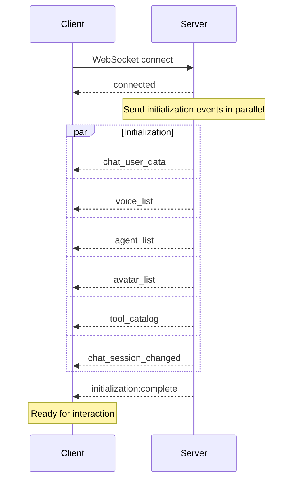
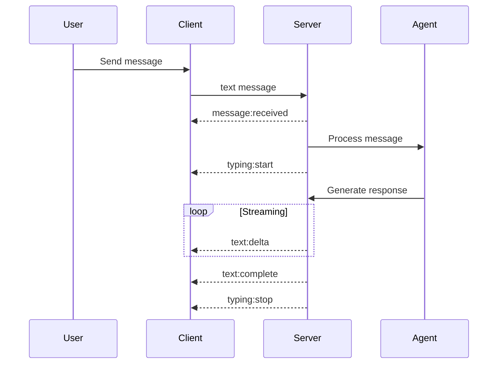
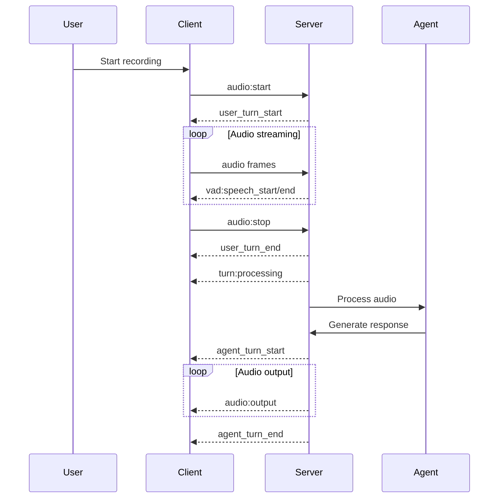

# Event System API Reference

## Overview

The Agent C Realtime SDK uses a comprehensive event-driven architecture. All data flows through events, from initialization to real-time interactions.

## Event Categories

### Initialization Events (Automatic)

These 6 events are automatically sent by the server immediately after WebSocket connection:

| Event | Description | Timing |
|-------|-------------|--------|
| `chat_user_data` | User profile information | ~100ms after connect |
| `voice_list` | Available voice models | ~100ms after connect |
| `agent_list` | Available agents | ~100ms after connect |
| `avatar_list` | Available avatars | ~100ms after connect |
| `tool_catalog` | Available tools | ~100ms after connect |
| `chat_session_changed` | Current chat session | ~100ms after connect |
| `initialization:complete` | All data received | After all above events |

### Connection Events

| Event | Description | Payload |
|-------|-------------|---------|
| `connecting` | WebSocket connecting | `{ attempt: number }` |
| `connected` | WebSocket connected | `{ sessionId: string }` |
| `disconnected` | WebSocket disconnected | `{ reason: string, code: number }` |
| `reconnecting` | Attempting reconnection | `{ attempt: number, maxAttempts: number }` |
| `error` | Connection error | `{ error: Error, fatal: boolean }` |

### Message Events

| Event | Description | Payload |
|-------|-------------|---------|
| `text:delta` | Streaming text chunk | `{ delta: string, messageId: string }` |
| `text:complete` | Complete message | `{ text: string, messageId: string, role: 'user' \| 'agent' }` |
| `typing:start` | Agent started typing | `{ agentId: string }` |
| `typing:stop` | Agent stopped typing | `{ agentId: string }` |
| `message:error` | Message send failed | `{ error: string, messageId: string }` |

### Audio Events

| Event | Description | Payload |
|-------|-------------|---------|
| `audio:output` | Binary audio frame | `ArrayBuffer` (PCM16 audio data) |
| `audio:start` | Audio stream started | `{ sampleRate: number, channels: number }` |
| `audio:stop` | Audio stream stopped | `{ duration: number }` |
| `audio:error` | Audio error | `{ error: string, code: string }` |
| `vad:speech_start` | Speech detected | `{ timestamp: number }` |
| `vad:speech_end` | Speech ended | `{ timestamp: number, duration: number }` |

### Turn Management Events

| Event | Description | Payload |
|-------|-------------|---------|
| `user_turn_start` | User can speak | `{ timestamp: number }` |
| `user_turn_end` | User should stop | `{ timestamp: number }` |
| `agent_turn_start` | Agent is speaking | `{ agentId: string, timestamp: number }` |
| `agent_turn_end` | Agent finished | `{ agentId: string, timestamp: number }` |
| `turn:processing` | Processing user input | `{ timestamp: number }` |

### Session Events

| Event | Description | Payload |
|-------|-------------|---------|
| `session:created` | New session created | `{ session: ChatSession }` |
| `session:switched` | Session changed | `{ session: ChatSession, previousId: string }` |
| `session:updated` | Session updated | `{ session: ChatSession, changes: string[] }` |
| `session:deleted` | Session deleted | `{ sessionId: string }` |

## Event Payload Details

### chat_user_data

```typescript
interface ChatUserDataEvent {
  type: 'chat_user_data';
  user: {
    user_id: string;
    display_name: string;
    email: string;
    created_at: number;
    updated_at: number;
    avatar_url?: string;
    metadata?: Record<string, any>;
    preferences?: {
      theme?: 'light' | 'dark';
      language?: string;
      timezone?: string;
    };
  };
}
```

### voice_list

```typescript
interface VoiceListEvent {
  type: 'voice_list';
  voices: Array<{
    voice_id: string;
    name: string;
    language: string;
    gender: 'male' | 'female' | 'neutral';
    preview_url?: string;
    sample_rate: number;
    style?: string;
    description?: string;
    is_premium?: boolean;
  }>;
}
```

### agent_list

```typescript
interface AgentListEvent {
  type: 'agent_list';
  agents: Array<{
    id: string;
    name: string;
    description?: string;
    avatar_url?: string;
    capabilities: string[];
    tools: string[];
    voice_id?: string;
    personality?: string;
    is_default?: boolean;
  }>;
}
```

### avatar_list

```typescript
interface AvatarListEvent {
  type: 'avatar_list';
  avatars: Array<{
    id: string;
    name: string;
    provider: 'heygen' | 'synthesia' | 'custom';
    thumbnail_url?: string;
    preview_url?: string;
    gender?: string;
    style?: string;
    is_premium?: boolean;
  }>;
}
```

### tool_catalog

```typescript
interface ToolCatalogEvent {
  type: 'tool_catalog';
  tools: Array<{
    id: string;
    name: string;
    description: string;
    category: string;
    parameters?: Record<string, any>;
    required_permissions?: string[];
    is_enabled: boolean;
  }>;
}
```

### chat_session_changed

```typescript
interface ChatSessionChangedEvent {
  type: 'chat_session_changed';
  session: {
    id: string;
    name?: string;
    created_at: number;
    updated_at: number;
    message_count: number;
    agent_id?: string;
    metadata?: Record<string, any>;
    is_active: boolean;
  };
  previous_session_id?: string;
  reason: 'created' | 'switched' | 'resumed' | 'auto';
}
```

## Listening to Events

### Using RealtimeClient

```typescript
import { RealtimeClient } from '@agentc/realtime-core';

const client = new RealtimeClient(config);

// Listen to specific events
client.on('chat_user_data', (event) => {
  console.log('User data received:', event.user);
});

client.on('text:delta', (event) => {
  console.log('Streaming text:', event.delta);
});

client.on('audio:output', (audioData: ArrayBuffer) => {
  // Handle binary audio data
  console.log('Audio frame size:', audioData.byteLength);
});

// Listen to all events
client.on('*', (eventName, eventData) => {
  console.log(`Event ${eventName}:`, eventData);
});

// Remove listener
const handler = (event) => console.log(event);
client.on('text:complete', handler);
client.off('text:complete', handler);
```

### Using React Hooks

```tsx
import { useEventListener } from '@agentc/realtime-react';

function MyComponent() {
  const [userData, setUserData] = useState(null);
  
  useEventListener('chat_user_data', (event) => {
    setUserData(event.user);
  });
  
  useEventListener('text:delta', (event) => {
    console.log('Text delta:', event.delta);
  }, []); // Dependencies array like useEffect
  
  return <div>{userData?.display_name}</div>;
}
```

## Event Timing and Sequencing

### Connection and Initialization Sequence



### Message Flow Sequence



### Audio Conversation Sequence



## Event Patterns

### Progressive Data Loading

```typescript
// Initialize with progressive loading
let initializationState = {
  userData: false,
  voices: false,
  agents: false,
  avatars: false,
  tools: false,
  session: false
};

client.on('chat_user_data', (event) => {
  initializationState.userData = true;
  updateUI(event.user);
});

client.on('voice_list', (event) => {
  initializationState.voices = true;
  populateVoiceSelector(event.voices);
});

client.on('initialization:complete', () => {
  console.log('All data loaded:', initializationState);
  enableFullUI();
});
```

### Event Aggregation

```typescript
// Aggregate streaming text
let currentMessage = '';
let messageId = null;

client.on('text:delta', (event) => {
  if (messageId !== event.messageId) {
    currentMessage = '';
    messageId = event.messageId;
  }
  currentMessage += event.delta;
  updateMessageDisplay(currentMessage);
});

client.on('text:complete', (event) => {
  finalizeMessage(event.text, event.messageId);
  currentMessage = '';
  messageId = null;
});
```

### Error Recovery

```typescript
// Handle connection errors with retry
client.on('error', (event) => {
  if (!event.fatal) {
    console.log('Non-fatal error, will retry:', event.error);
    return;
  }
  
  // Fatal error - need user intervention
  showErrorDialog(event.error);
});

client.on('reconnecting', (event) => {
  showReconnectingUI(event.attempt, event.maxAttempts);
});

client.on('connected', () => {
  hideReconnectingUI();
  // Initialization events will follow automatically
});
```

### Turn Management

```typescript
// Respect turn state for audio
let canSpeak = false;

client.on('user_turn_start', () => {
  canSpeak = true;
  enableMicrophone();
});

client.on('user_turn_end', () => {
  canSpeak = false;
  disableMicrophone();
});

client.on('agent_turn_start', () => {
  showSpeakingIndicator();
});

client.on('agent_turn_end', () => {
  hideSpeakingIndicator();
});
```

## Custom Events

You can emit custom events for application-specific needs:

```typescript
// Emit custom event
client.emit('custom:user_action', {
  action: 'button_clicked',
  value: 'help',
  timestamp: Date.now()
});

// Listen for custom events
client.on('custom:server_notification', (event) => {
  showNotification(event.message);
});
```

## Event Debugging

### Enable Event Logging

```typescript
// Log all events for debugging
if (process.env.NODE_ENV === 'development') {
  client.on('*', (eventName, eventData) => {
    console.group(`[Event] ${eventName}`);
    console.log('Data:', eventData);
    console.log('Timestamp:', new Date().toISOString());
    console.groupEnd();
  });
}
```

### Event Inspector

```typescript
class EventInspector {
  private events: Array<{name: string, data: any, timestamp: number}> = [];
  
  constructor(client: RealtimeClient) {
    client.on('*', (name, data) => {
      this.events.push({
        name,
        data,
        timestamp: Date.now()
      });
      
      // Keep last 100 events
      if (this.events.length > 100) {
        this.events.shift();
      }
    });
  }
  
  getEvents(filter?: string): typeof this.events {
    if (!filter) return this.events;
    return this.events.filter(e => e.name.includes(filter));
  }
  
  getEventStats(): Record<string, number> {
    const stats: Record<string, number> = {};
    this.events.forEach(e => {
      stats[e.name] = (stats[e.name] || 0) + 1;
    });
    return stats;
  }
}

// Use in development
const inspector = new EventInspector(client);

// Later, inspect events
console.table(inspector.getEventStats());
console.log('Text events:', inspector.getEvents('text:'));
```

## Performance Considerations

### Event Throttling

```typescript
// Throttle high-frequency events
import { throttle } from 'lodash';

const throttledAudioHandler = throttle((audioData: ArrayBuffer) => {
  updateAudioVisualization(audioData);
}, 100); // Max once per 100ms

client.on('audio:output', throttledAudioHandler);
```

### Event Batching

```typescript
// Batch multiple events for processing
class EventBatcher {
  private batch: any[] = [];
  private timer: NodeJS.Timeout | null = null;
  
  constructor(
    private processor: (events: any[]) => void,
    private delay: number = 100
  ) {}
  
  add(event: any) {
    this.batch.push(event);
    
    if (this.timer) clearTimeout(this.timer);
    
    this.timer = setTimeout(() => {
      this.processor(this.batch);
      this.batch = [];
      this.timer = null;
    }, this.delay);
  }
}

const textBatcher = new EventBatcher((events) => {
  const fullText = events.map(e => e.delta).join('');
  updateDisplay(fullText);
});

client.on('text:delta', (event) => {
  textBatcher.add(event);
});
```

### Memory Management

```typescript
// Clean up event listeners properly
class ComponentWithEvents {
  private handlers = new Map<string, Function>();
  
  constructor(private client: RealtimeClient) {
    this.setupListeners();
  }
  
  setupListeners() {
    const userHandler = (event) => this.handleUser(event);
    const textHandler = (event) => this.handleText(event);
    
    this.handlers.set('chat_user_data', userHandler);
    this.handlers.set('text:complete', textHandler);
    
    this.client.on('chat_user_data', userHandler);
    this.client.on('text:complete', textHandler);
  }
  
  cleanup() {
    // Remove all listeners
    this.handlers.forEach((handler, event) => {
      this.client.off(event, handler);
    });
    this.handlers.clear();
  }
  
  private handleUser(event: any) { /* ... */ }
  private handleText(event: any) { /* ... */ }
}
```

## Best Practices

### 1. Always Wait for Initialization

```typescript
// Don't access data immediately
// ❌ Wrong
client.connect();
console.log(client.getUser()); // Will be undefined

// ✅ Correct
client.connect();
client.on('initialization:complete', () => {
  console.log(client.getUser()); // Data is ready
});
```

### 2. Handle Events Defensively

```typescript
// Use optional chaining and defaults
client.on('chat_user_data', (event) => {
  const name = event?.user?.display_name || 'Guest';
  const email = event?.user?.email || 'No email';
  updateProfile(name, email);
});
```

### 3. Clean Up Listeners

```typescript
// In React components
useEffect(() => {
  const handler = (event) => console.log(event);
  client.on('text:complete', handler);
  
  return () => {
    client.off('text:complete', handler);
  };
}, [client]);
```

### 4. Use Event Types

```typescript
import type { 
  ChatUserDataEvent,
  VoiceListEvent,
  TextDeltaEvent 
} from '@agentc/realtime-core';

client.on('chat_user_data', (event: ChatUserDataEvent) => {
  // TypeScript knows the event structure
  console.log(event.user.display_name);
});
```

## Event Type Definitions

All event types are exported from the core package:

```typescript
import type {
  // Initialization events
  ChatUserDataEvent,
  VoiceListEvent,
  AgentListEvent,
  AvatarListEvent,
  ToolCatalogEvent,
  ChatSessionChangedEvent,
  
  // Connection events
  ConnectedEvent,
  DisconnectedEvent,
  ReconnectingEvent,
  ErrorEvent,
  
  // Message events
  TextDeltaEvent,
  TextCompleteEvent,
  TypingStartEvent,
  TypingStopEvent,
  
  // Audio events
  AudioOutputEvent,
  AudioStartEvent,
  AudioStopEvent,
  VADSpeechStartEvent,
  VADSpeechEndEvent,
  
  // Turn events
  UserTurnStartEvent,
  UserTurnEndEvent,
  AgentTurnStartEvent,
  AgentTurnEndEvent,
  TurnProcessingEvent,
  
  // Session events
  SessionCreatedEvent,
  SessionSwitchedEvent,
  SessionUpdatedEvent,
  SessionDeletedEvent
} from '@agentc/realtime-core';
```