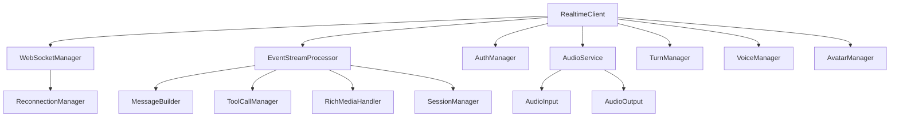

# Agent C Realtime SDK - Core API Reference

Welcome to the Agent C Realtime SDK core API reference documentation. This guide provides comprehensive documentation for all classes, interfaces, and utilities in the `@agentc/realtime-core` package.

## Quick Navigation

### 🚀 Getting Started
- [**RealtimeClient**](./RealtimeClient.md) - Main client class and entry point
- [**ClientConfig**](./ClientConfig.md) - Configuration options and setup
- [**Types**](./Types.md) - Complete TypeScript type reference

### 📡 Core Infrastructure
- [**WebSocketManager**](./WebSocketManager.md) - WebSocket connection management
- [**ReconnectionManager**](./ReconnectionManager.md) - Automatic reconnection with exponential backoff
- [**EventSystem**](./EventSystem.md) - Event emitter and registry system
- [**Events**](./events.md) - Complete event reference and patterns

### 💬 Message Processing
- [**MessageBuilder**](./MessageBuilder.md) - Streaming message accumulation
- [**EventStreamProcessor**](./EventStreamProcessor.md) - Central event processing orchestrator
- [**ToolCallManager**](./ToolCallManager.md) - Tool execution lifecycle management
- [**RichMediaHandler**](./RichMediaHandler.md) - Rich media content processing
- [**AdvancedMessageHandlers**](./AdvancedMessageHandlers.md) - Combined tool and media handling

### 🔐 Authentication & Session
- [**AuthManager**](./AuthManager.md) - JWT authentication and token refresh
- [**SessionManager**](./SessionManager.md) - Chat session and message history

### 🎙️ Audio System
- [**AudioInput**](./AudioInput.md) - Microphone input and processing
- [**AudioOutput**](./AudioOutput.md) - Audio playback management
- [**AudioOutputService**](./AudioOutputService.md) - TTS audio playback service
- [**AudioProcessor**](./AudioProcessor.md) - Real-time audio processing worklet

### 🎭 Interaction Management
- [**TurnManager**](./TurnManager.md) - Turn-based conversation management
- [**VoiceManager**](./VoiceManager.md) - Voice model selection
- [**AvatarManager**](./AvatarManager.md) - HeyGen avatar integration

### 🛠️ Utilities
- [**Logger**](./Logger.md) - Structured logging system
- [**MessageUtilities**](./MessageUtilities.md) - Message conversion and validation
- [**Utilities**](./Utilities.md) - Overview of all utility modules

## Package Structure

```
@agentc/realtime-core/
├── client/           # Core client and connection
├── auth/            # Authentication management
├── session/         # Session and turn management
├── events/          # Event system and processing
├── audio/           # Audio input/output
├── avatar/          # Avatar integration
├── voice/           # Voice management
├── types/           # TypeScript definitions
└── utils/           # Utility functions
```

## Import Examples

```typescript
// Main client
import { RealtimeClient } from '@agentc/realtime-core';

// Managers
import { 
  AuthManager,
  SessionManager,
  TurnManager,
  VoiceManager,
  AvatarManager
} from '@agentc/realtime-core';

// Types
import type {
  RealtimeClientConfig,
  EnhancedMessage,
  ChatSession,
  ClientEvent,
  ServerEvent
} from '@agentc/realtime-core';

// Utilities
import {
  Logger,
  normalizeMessageContent,
  isValidMessage
} from '@agentc/realtime-core';
```

## Common Use Cases

### Basic Setup
Start with [RealtimeClient](./RealtimeClient.md) and [ClientConfig](./ClientConfig.md) to initialize your connection.

### Handling Events
Review [Events](./events.md) for all available events and [EventSystem](./EventSystem.md) for event handling patterns.

### Message Processing
Understand message flow through [EventStreamProcessor](./EventStreamProcessor.md) and [MessageBuilder](./MessageBuilder.md).

### Audio Integration
See [AudioInput](./AudioInput.md) and [AudioOutput](./AudioOutput.md) for voice chat capabilities.

### Authentication
Implement secure authentication with [AuthManager](./AuthManager.md).

## Architecture Overview



## Key Concepts

### Event-Driven Architecture
The SDK uses events for all real-time communication. Components emit and listen to events for loose coupling and flexibility.

### Manager Pattern
Core functionality is organized into focused manager classes that handle specific domains (auth, session, audio, etc.).

### Streaming Support
Messages and audio are streamed in real-time with proper accumulation and state management.

### Type Safety
Full TypeScript support with comprehensive type definitions and type guards.

## Version Information

Current Version: 1.0.0

### Browser Requirements
- Chrome 90+
- Firefox 88+
- Safari 14.1+
- Edge 90+

### Required APIs
- WebSocket API
- Web Audio API
- MediaDevices API (for audio input)

## Support

For issues, questions, or contributions:
- Review the documentation thoroughly
- Check the [Events](./events.md) reference for event handling
- Consult [Types](./Types.md) for TypeScript definitions
- Use [Logger](./Logger.md) for debugging

## License

See LICENSE file in the repository root.