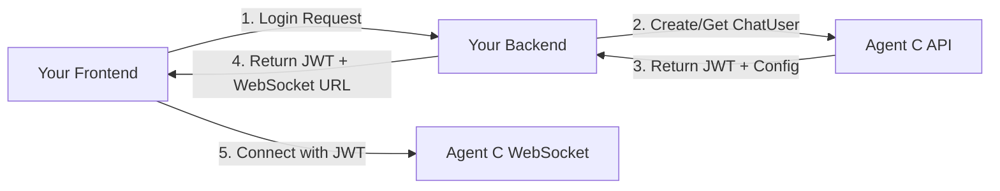

# Getting Started with Agent C Realtime SDK

This guide will help you get up and running with the Agent C Realtime SDK. We'll cover the authentication architecture, installation, and proper setup for both production and development environments.

## Prerequisites

Before you begin, ensure you have:

- **Node.js** version 16.0 or later
- **A modern web browser** (Chrome 66+, Firefox 76+, or Safari 14.1+)
- **Basic knowledge** of JavaScript/TypeScript

For React applications, you'll also need:
- **React** version 18.0 or later

For production applications:
- **Your own backend server** that manages authentication with Agent C
- **Agent C API credentials** (for your backend only, never exposed to frontend)

## Understanding Authentication Architecture

**⚠️ IMPORTANT:** The Agent C Realtime SDK follows a secure authentication pattern where your frontend NEVER directly authenticates with Agent C in production.

### Production Authentication Flow



1. **Your frontend** authenticates with **your backend** using your own authentication system
2. **Your backend** manages ChatUsers and authenticates with Agent C using your API credentials
3. **Agent C** returns a JWT token and WebSocket configuration to your backend
4. **Your backend** passes the JWT and WebSocket URL to your frontend
5. **Your frontend** connects directly to Agent C WebSocket using the JWT token

### Key Security Principles

- **Frontend never has Agent C credentials** - Only your backend knows the API keys
- **Your backend is the security boundary** - It decides who can access Agent C
- **JWTs are short-lived** - Your backend handles token refresh
- **WebSocket URLs are dynamic** - Each session may use different endpoints

### Development vs Production

| Aspect | Production | Development |
|--------|------------|-------------|
| Authentication | Your backend → Agent C | Direct login (testing only) |
| Credentials | Stored securely on backend | Can use .env locally |
| Token Management | Backend handles refresh | SDK auto-refresh |
| Security | Full isolation | Convenient but insecure |

📘 **Complete Initialization Guide**  
The login response contains much more than just tokens - it includes agents, voices, avatars, toolsets, and user information. For a comprehensive guide on using ALL the login payload data, see our [Complete Initialization Example](./examples/complete-initialization.md).

**Important:** The WebSocket URL is NOT included in the login response and must be constructed from your API host configuration.

## Installation

Choose your package manager and install the appropriate packages:

### Core SDK (Vanilla JavaScript/TypeScript)

```bash
# NPM
npm install @agentc/realtime-core

# Yarn
yarn add @agentc/realtime-core

# PNPM
pnpm add @agentc/realtime-core
```

### React Bindings (For React Applications)

```bash
# NPM
npm install @agentc/realtime-core @agentc/realtime-react

# Yarn
yarn add @agentc/realtime-core @agentc/realtime-react

# PNPM
pnpm add @agentc/realtime-core @agentc/realtime-react
```

## Production Setup (The Right Way)

In production, your frontend receives authentication tokens from YOUR backend, not from Agent C directly.

### Step 1: Your Backend Endpoint

Your backend should have an endpoint that:
1. Authenticates the user with your system
2. Creates or retrieves a ChatUser from Agent C
3. Returns the JWT token and WebSocket URL to your frontend

```typescript
// Example: Your backend endpoint (Express.js)
app.post('/api/agent-c/session', authenticate, async (req, res) => {
    // Your user is already authenticated by your system
    const userId = req.user.id;
    
    // Your backend talks to Agent C (credentials stored securely)
    const agentCResponse = await fetch('https://api.agentc.ai/auth/login', {
        method: 'POST',
        headers: {
            'Content-Type': 'application/json',
            'X-API-Key': process.env.AGENTC_API_KEY // Your API key, never exposed
        },
        body: JSON.stringify({
            chatUserId: `user_${userId}`, // Map your users to ChatUsers
            // Other ChatUser configuration
        })
    });
    
    const payload = await agentCResponse.json();
    
    // Return only what the frontend needs
    res.json({
        token: payload.token,
        websocketUrl: payload.websocketUrl,
        voices: payload.voices,
        avatars: payload.avatars,
        heygenToken: payload.heygenToken // If using avatars
    });
});
```

### Step 2: Frontend Implementation

#### Option 1: Using initializeFromPayload()

```typescript
import { RealtimeClient, AuthManager } from '@agentc/realtime-core';

async function connectToAgentC() {
    // 1. Get configuration from YOUR backend
    const response = await fetch('/api/agent-c/session', {
        method: 'POST',
        headers: {
            'Authorization': `Bearer ${yourAppToken}` // Your app's auth
        }
    });
    
    const payload = await response.json();
    // payload contains: token, websocketUrl, voices, avatars, heygenToken
    
    // 2. Initialize the SDK with the payload from your backend
    const authManager = new AuthManager();
    authManager.initializeFromPayload(payload);
    
    // 3. Create the client using the configuration
    const client = new RealtimeClient({
        apiUrl: payload.websocketUrl,  // Dynamic WebSocket URL
        authManager,
        enableAudio: true,
        debug: false // Production shouldn't have debug on
    });
    
    // 4. Set up event handlers
    client.on('connected', () => {
        console.log('Connected to Agent C!');
    });
    
    client.on('text_delta', (event) => {
        console.log('Agent:', event.content);
    });
    
    // 5. Connect to the WebSocket
    await client.connect();
    
    // 6. Start chatting
    client.sendText('Hello!');
    
    return client;
}
```

#### Option 2: Using setTokens()

```typescript
import { RealtimeClient, AuthManager } from '@agentc/realtime-core';

async function connectToAgentC() {
    // 1. Get configuration from YOUR backend
    const response = await fetch('/api/agent-c/session', {
        method: 'POST',
        headers: {
            'Authorization': `Bearer ${yourAppToken}`
        }
    });
    
    const { token, websocketUrl, heygenToken } = await response.json();
    
    // 2. Set tokens directly
    const authManager = new AuthManager();
    authManager.setTokens({
        accessToken: token,
        heygenToken: heygenToken // Optional, for avatar support
    });
    
    // 3. Create and connect the client
    const client = new RealtimeClient({
        apiUrl: websocketUrl,  // From your backend
        authManager,
        enableAudio: true
    });
    
    await client.connect();
    return client;
}
```

### Step 3: React Implementation

**⚠️ Note:** The React provider should NOT have username/password configuration in production!

```tsx
// App.tsx - Production Pattern
import React, { useEffect, useState } from 'react';
import { AgentCProvider } from '@agentc/realtime-react';
import ChatInterface from './ChatInterface';

function App() {
    const [agentConfig, setAgentConfig] = useState(null);
    
    useEffect(() => {
        // Get configuration from YOUR backend
        async function fetchConfig() {
            const response = await fetch('/api/agent-c/session', {
                method: 'POST',
                headers: {
                    'Authorization': `Bearer ${localStorage.getItem('authToken')}`
                }
            });
            
            const config = await response.json();
            setAgentConfig(config);
        }
        
        fetchConfig();
    }, []);
    
    if (!agentConfig) {
        return <div>Loading...</div>;
    }
    
    // Pass the configuration from your backend
    return (
        <AgentCProvider 
            config={{
                websocketUrl: agentConfig.websocketUrl,
                authToken: agentConfig.token,
                heygenToken: agentConfig.heygenToken,
                voices: agentConfig.voices,
                avatars: agentConfig.avatars,
                enableAudio: true,
                debug: false // No debug in production
            }}
        >
            <ChatInterface />
        </AgentCProvider>
    );
}

export default App;
```

```tsx
// ChatInterface.tsx - Same for both production and development
import React, { useState } from 'react';
import { 
    useConnection, 
    useChat,
    useAudio 
} from '@agentc/realtime-react';

function ChatInterface() {
    const { connect, disconnect, isConnected } = useConnection();
    const { messages, sendMessage } = useChat();
    const { startRecording, stopRecording, isRecording } = useAudio();
    const [input, setInput] = useState('');
    
    const handleConnect = async () => {
        try {
            await connect();
        } catch (error) {
            console.error('Connection failed:', error);
        }
    };
    
    const handleSend = () => {
        if (input.trim() && isConnected) {
            sendMessage(input);
            setInput('');
        }
    };
    
    return (
        <div>
            <button onClick={isConnected ? disconnect : handleConnect}>
                {isConnected ? 'Disconnect' : 'Connect'}
            </button>
            
            <button 
                onClick={isRecording ? stopRecording : startRecording}
                disabled={!isConnected}
            >
                {isRecording ? 'Stop Recording' : 'Start Recording'}
            </button>
            
            <div className="messages">
                {messages.map((msg, i) => (
                    <div key={i} className={msg.role}>
                        {msg.content}
                    </div>
                ))}
            </div>
            
            <input
                value={input}
                onChange={(e) => setInput(e.target.value)}
                onKeyPress={(e) => e.key === 'Enter' && handleSend()}
                disabled={!isConnected}
            />
            <button onClick={handleSend} disabled={!isConnected}>
                Send
            </button>
        </div>
    );
}

export default ChatInterface;
```

## Development Quick Start (For Testing Only)

**⚠️ WARNING:** The following patterns use direct authentication with Agent C and should NEVER be used in production. These are for development and testing ONLY.

**🚫 NEVER:**
- Put Agent C credentials in frontend code
- Use username/password authentication from the browser
- Ship these patterns to production
- Store API keys in client-side environment variables

### Direct Login Pattern (Development Only)

For quick development testing, you can use direct login, but understand this is NOT how production apps work:

```typescript
import { RealtimeClient, AuthManager } from '@agentc/realtime-core';

// ⚠️ DEVELOPMENT ONLY - NEVER DO THIS IN PRODUCTION!
async function quickDevelopmentSetup() {
    // Initialize authentication with REST API URL
    const authManager = new AuthManager({
        apiUrl: 'https://localhost:8000'  // Local development API
    });
    
    // Direct login - ONLY for development
    const loginResponse = await authManager.login({
        username: 'test-user',  // Development credentials
        password: 'test-pass'   // NEVER hardcode in production
    });
    
    // Create the client
    const client = new RealtimeClient({
        apiUrl: loginResponse.websocketUrl,
        authManager,
        debug: true // Debug mode for development
    });
    
    // Connect and use
    await client.connect();
    client.sendText('Hello from development!');
    
    return client;
}
```

### React Development Setup

For React development, you might temporarily use direct authentication:

```tsx
// App.tsx - DEVELOPMENT ONLY
import React from 'react';
import { AgentCProvider } from '@agentc/realtime-react';
import ChatInterface from './ChatInterface';

// ⚠️ This is for development only!
// In production, fetch config from YOUR backend (see Production Setup above)
function DevelopmentApp() {
    return (
        <AgentCProvider 
            config={{
                restApiUrl: 'https://localhost:8000',  // Dev API
                username: process.env.REACT_APP_DEV_USERNAME, // Dev only!
                password: process.env.REACT_APP_DEV_PASSWORD, // Dev only!
                enableAudio: true,
                debug: true
            }}
        >
            <ChatInterface />
        </AgentCProvider>
    );
}

export default DevelopmentApp;
```

### Development Environment Variables

For local development ONLY:

```bash
# .env.development - NEVER commit this file!
REACT_APP_DEV_USERNAME=test-user
REACT_APP_DEV_PASSWORD=test-pass

# Remember: These should NEVER exist in production!
```

## Complete Example: Production Pattern

Here's a complete example showing the proper production authentication flow:

### Your Backend API

```typescript
// backend/routes/agentc.js
import express from 'express';
import { authenticateUser } from './auth';  // Your auth system

const router = express.Router();

// Your backend endpoint that frontend calls
router.post('/agent-c/session', authenticateUser, async (req, res) => {
    try {
        // Map your user to an Agent C ChatUser
        const chatUserId = `user_${req.user.id}`;
        
        // Your backend authenticates with Agent C
        const response = await fetch(process.env.AGENTC_API_URL + '/auth/login', {
            method: 'POST',
            headers: {
                'Content-Type': 'application/json',
                'X-API-Key': process.env.AGENTC_API_KEY  // Your secret API key
            },
            body: JSON.stringify({
                chatUserId,
                // Additional ChatUser configuration
            })
        });
        
        if (!response.ok) {
            throw new Error('Failed to authenticate with Agent C');
        }
        
        const agentCPayload = await response.json();
        
        // Return only what frontend needs (no API keys!)
        res.json({
            token: agentCPayload.token,
            websocketUrl: agentCPayload.websocketUrl,
            voices: agentCPayload.voices,
            avatars: agentCPayload.avatars,
            heygenToken: agentCPayload.heygenToken
        });
    } catch (error) {
        console.error('Agent C session error:', error);
        res.status(500).json({ error: 'Failed to create session' });
    }
});

export default router;
```

### Your Frontend Application

```typescript
// frontend/services/agentc.ts
import { RealtimeClient, AuthManager } from '@agentc/realtime-core';

export class AgentCService {
    private client: RealtimeClient | null = null;
    private authManager: AuthManager;
    
    constructor() {
        this.authManager = new AuthManager();
    }
    
    async connect(): Promise<RealtimeClient> {
        // 1. Get configuration from YOUR backend
        const response = await fetch('/api/agent-c/session', {
            method: 'POST',
            headers: {
                'Authorization': `Bearer ${localStorage.getItem('authToken')}`,
                'Content-Type': 'application/json'
            }
        });
        
        if (!response.ok) {
            throw new Error('Failed to get Agent C session');
        }
        
        const payload = await response.json();
        
        // 2. Initialize SDK with payload from your backend
        this.authManager.initializeFromPayload(payload);
        
        // 3. Create the client
        this.client = new RealtimeClient({
            apiUrl: payload.websocketUrl,  // Dynamic URL from your backend
            authManager: this.authManager,
            enableAudio: true,
            audioConfig: {
                enableInput: true,
                enableOutput: true,
                sampleRate: 16000,
                respectTurnState: true
            }
        });
        
        // 4. Set up event handlers
        this.setupEventHandlers();
        
        // 5. Connect to WebSocket
        await this.client.connect();
        
        return this.client;
    }
    
    private setupEventHandlers() {
        if (!this.client) return;
        
        this.client.on('connected', () => {
            console.log('✅ Connected to Agent C!');
        });
        
        this.client.on('text_delta', (event) => {
            // Handle streaming text
            console.log('Agent:', event.content);
        });
        
        this.client.on('audio:output', (audioData) => {
            // Binary audio received
            console.log('Audio chunk:', audioData.byteLength, 'bytes');
        });
        
        this.client.on('error', (error) => {
            console.error('❌ Error:', error.message);
        });
    }
    
    sendMessage(text: string) {
        if (this.client) {
            this.client.sendText(text);
        }
    }
    
    disconnect() {
        if (this.client) {
            this.client.disconnect();
            this.client = null;
        }
    }
}

// Usage in your app
const agentC = new AgentCService();
await agentC.connect();
agentC.sendMessage('Hello!');
```

## Environment Configuration

### Production Environment Variables

Your BACKEND should have:

```bash
# .env.production (Backend only!)
AGENTC_API_URL=https://api.agentc.ai
AGENTC_API_KEY=your-secret-api-key  # NEVER expose to frontend
AGENTC_API_SECRET=your-secret       # NEVER expose to frontend
```

Your FRONTEND should have:

```bash
# .env.production (Frontend)
REACT_APP_API_URL=https://your-backend.com  # YOUR backend, not Agent C
REACT_APP_ENVIRONMENT=production
```

### Development Environment Variables

For local development testing ONLY:

```bash
# .env.development (NEVER commit!)
AGENTC_REST_API_URL=https://localhost:8000
AGENTC_DEV_USERNAME=test-user  # Dev only
AGENTC_DEV_PASSWORD=test-pass  # Dev only
AGENTC_DEBUG=true
```

### Security Checklist

✅ **DO:**
- Store Agent C API credentials on your backend only
- Use your own authentication system for users
- Pass only JWT tokens to the frontend
- Implement token refresh on your backend
- Use HTTPS in production

❌ **DON'T:**
- Put Agent C credentials in frontend code
- Use direct login from the browser in production
- Store API keys in client-side environment variables
- Expose your Agent C API keys to users
- Use development patterns in production

## Adding Audio Support

To enable voice interactions with proper authentication:

```typescript
// After getting configuration from your backend
const payload = await fetch('/api/agent-c/session', {
    method: 'POST',
    headers: { 'Authorization': `Bearer ${yourAuthToken}` }
}).then(r => r.json());

const authManager = new AuthManager();
authManager.initializeFromPayload(payload);

const client = new RealtimeClient({
    apiUrl: payload.websocketUrl,  // From your backend
    authManager,
    enableAudio: true,
    audioConfig: {
        enableInput: true,    // Enable microphone
        enableOutput: true,   // Enable TTS playback
        sampleRate: 16000,    // Audio sample rate
        respectTurnState: true, // Prevent talk-over
        initialVolume: 0.8    // Initial volume (0-1)
    }
});

// Connect first
await client.connect();

// Request microphone permission and start recording
await client.startAudioRecording();

// Start streaming audio to server
client.startAudioStreaming();

// Monitor audio levels
const status = client.getAudioStatus();
console.log('Audio level:', status.currentLevel);
console.log('Is recording:', status.isRecording);

// Stop audio when done
client.stopAudioStreaming();
client.stopAudioRecording();
```

## Handling Events

The SDK emits various events you can listen to:

```typescript
// Connection events
client.on('connected', () => console.log('Connected'));
client.on('disconnected', ({ code, reason }) => console.log('Disconnected:', reason));
client.on('reconnecting', ({ attempt }) => console.log('Reconnecting, attempt:', attempt));

// Message events
client.on('text_delta', (event) => console.log('Text chunk:', event.content));
client.on('completion', (event) => console.log('Complete:', !event.running));

// Audio events
client.on('audio:output', (audioData) => console.log('Audio received'));
client.on('audio:input:start', () => console.log('Recording started'));
client.on('audio:input:stop', () => console.log('Recording stopped'));

// Turn events
client.on('user_turn_start', () => console.log('Your turn to speak'));
client.on('user_turn_end', () => console.log('Agent is responding'));

// Voice events
client.on('agent_voice_changed', (event) => console.log('Voice changed to:', event.voice_id));

// Error events
client.on('error', (error) => console.error('Error:', error));
```

## Error Handling

Always implement proper error handling:

```typescript
try {
    await client.connect();
} catch (error) {
    if (error.message.includes('Authentication')) {
        console.error('Invalid credentials or expired token');
    } else if (error.message.includes('timeout')) {
        console.error('Connection timeout - check your network');
    } else {
        console.error('Connection failed:', error);
    }
}

// Handle audio permission errors
try {
    await client.startAudioRecording();
} catch (error) {
    if (error.name === 'NotAllowedError') {
        console.error('Microphone permission denied');
    } else if (error.name === 'NotFoundError') {
        console.error('No microphone found');
    } else {
        console.error('Audio initialization failed:', error);
    }
}
```

## TypeScript Support

The SDK is written in TypeScript and provides full type definitions:

```typescript
import { 
    RealtimeClient, 
    AuthManager,
    ConnectionState,
    RealtimeEventMap,
    TextDeltaEvent,
    CompletionEvent,
    LoginPayload,
    RealtimeClientConfig 
} from '@agentc/realtime-core';

// Type-safe payload from your backend
interface BackendResponse {
    token: string;
    websocketUrl: string;
    voices: Voice[];
    avatars?: Avatar[];
    heygenToken?: string;
}

const payload: BackendResponse = await fetch('/api/agent-c/session', {
    method: 'POST',
    headers: { 'Authorization': `Bearer ${token}` }
}).then(r => r.json());

// Initialize with typed payload
const authManager = new AuthManager();
authManager.initializeFromPayload(payload as LoginPayload);

// Configuration is fully typed
const config: RealtimeClientConfig = {
    apiUrl: payload.websocketUrl,  // From your backend
    authManager,
    enableAudio: true,
    reconnection: {
        maxAttempts: 5,
        initialDelay: 1000
    }
};

const client = new RealtimeClient(config);

// All event handlers are type-safe
client.on('text_delta', (event: TextDeltaEvent) => {
    // TypeScript knows event.content is a string
    console.log(event.content);
});

// Check connection state with enum
if (client.getConnectionState() === ConnectionState.CONNECTED) {
    // Connected and ready
}
```

## Migrating from Direct Authentication

If you were using direct authentication (username/password from frontend), here's how to migrate:

### Before (Incorrect Pattern)
```typescript
// ❌ OLD: Frontend directly authenticates with Agent C
const authManager = new AuthManager({
    apiUrl: 'https://api.agentc.ai'
});

const loginResponse = await authManager.login({
    username: 'user',  // ❌ Exposed credentials
    password: 'pass'   // ❌ Security risk
});
```

### After (Correct Pattern)
```typescript
// ✅ NEW: Frontend gets config from YOUR backend
const response = await fetch('/api/agent-c/session', {
    method: 'POST',
    headers: { 'Authorization': `Bearer ${yourAppToken}` }
});

const payload = await response.json();

const authManager = new AuthManager();
authManager.initializeFromPayload(payload);  // ✅ No credentials exposed
```

### Migration Steps

1. **Create a backend endpoint** that handles Agent C authentication
2. **Move credentials** from frontend to backend environment variables
3. **Update frontend** to call your backend instead of Agent C directly
4. **Use initializeFromPayload()** or **setTokens()** instead of login()
5. **Test thoroughly** before deploying to production

## Next Steps

Now that you understand the proper authentication pattern:

1. **Explore the API Reference** to learn about all available methods and options
2. **Read the Guides** for in-depth coverage of specific features:
   - [Authentication](./guides/authentication.md) - Token management and refresh
   - [Audio Streaming](./guides/audio-streaming.md) - Voice interactions
   - [Turn Management](./guides/turn-management.md) - Conversation flow
   - [Voice Models](./guides/voice-models.md) - TTS options
   - [Avatar Integration](./guides/avatar-integration.md) - Virtual avatars

3. **Check out the Examples** for complete applications:
   - Production authentication flow
   - Voice assistant with proper auth
   - Avatar demo with backend integration
   - React application with secure setup

## Troubleshooting

### Common Issues

**Connection fails immediately**
- Verify your backend is returning a valid JWT token
- Check the WebSocket URL from your backend is correct
- Ensure the JWT token hasn't expired (your backend should refresh it)
- Confirm your backend is properly authenticated with Agent C
- In development: Check username/password are valid

**No audio output**
- Check browser supports Web Audio API
- Verify `enableOutput: true` in audio config
- Check system volume and browser permissions

**Microphone not working**
- Browser requires HTTPS for microphone access
- User must grant permission when prompted
- Check `enableInput: true` in audio config

**Messages not appearing**
- Ensure you're listening to the correct events
- Check the console for error messages
- Verify the connection is established

### Getting Help

If you encounter issues:

1. Check the [documentation](./README.md)
2. Search [GitHub issues](https://github.com/agentc-ai/realtime-sdk/issues)
3. Join our [Discord community](https://discord.gg/agentc)
4. Contact support at support@agentc.ai

---

Ready to build something amazing? Let's go! 🚀