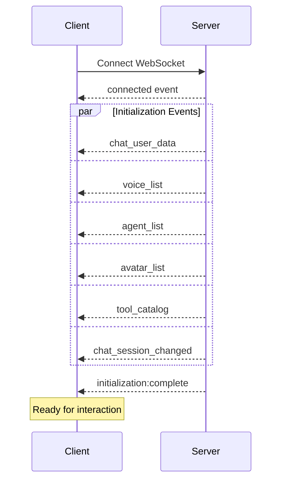

# Getting Started with Agent C Realtime SDK

Welcome to the Agent C Realtime SDK! This guide will help you set up and start using the SDK for voice and text conversations with AI agents.

## Installation

### Prerequisites
- Node.js 18+ 
- HTTPS enabled (required for microphone access)
- Modern browser with WebRTC support

### Package Installation

```bash
# Core SDK
npm install @agentc/realtime-core

# React integration (optional)
npm install @agentc/realtime-react

# UI Components (optional)
npm install @agentc/realtime-ui
```

### Audio Worklet Setup

The SDK requires an audio worklet file for high-performance audio processing:

```bash
# Copy the worklet to your public directory
cp node_modules/@agentc/realtime-core/dist/worklets/audio-processor.worklet.js public/worklets/
```

## Quick Start

### 1. Initialize Authentication

The SDK supports two authentication patterns:

#### Development Mode (Direct Login)
```typescript
import { AuthManager, RealtimeClient } from '@agentc/realtime-core';

// Create auth manager
const authManager = new AuthManager({
  apiUrl: 'https://api.agentc.ai'
});

// Development only - direct login with ChatUser credentials
const loginResponse = await authManager.login({
  username: 'your-username',
  password: 'your-password'
});
```

#### Production Mode (Token from Backend)
```typescript
// Your backend handles ChatUser credentials and returns tokens
const response = await fetch('/api/auth/agentc-token', {
  headers: { 'Authorization': `Bearer ${yourAppToken}` }
});

const agentCTokens = await response.json();

// Initialize with tokens from your backend
await authManager.initializeFromPayload(agentCTokens);
```

### 2. Create and Connect Client

```typescript
// Create the realtime client
const client = new RealtimeClient({
  apiUrl: authManager.getWebSocketUrl(),
  authManager: authManager,
  audioConfig: {
    enableAudio: true,
    enableVAD: true,
    vadThreshold: 0.3
  }
});

// Connect to the WebSocket
await client.connect();

// The SDK will automatically send 6 initialization events:
// 1. chat_user_data - User profile
// 2. voice_list - Available voices
// 3. agent_list - Available agents  
// 4. avatar_list - Available avatars
// 5. tool_catalog - Available tools
// 6. chat_session_changed - Current session
```

### 3. Handle Events

The SDK uses an event-driven architecture. After connection, you'll receive initialization data automatically:

```typescript
// User data event
client.on('chat_user_data', (event) => {
  console.log('User:', event.user);
  // { user_id, display_name, email, created_at, ... }
});

// Available voices
client.on('voice_list', (event) => {
  console.log('Voices:', event.voices);
  // [{ voice_id: 'nova', name: 'Nova', ... }, ...]
});

// Available agents
client.on('agent_list', (event) => {
  console.log('Agents:', event.agents);
  // [{ id: 'agent-1', name: 'Assistant', ... }, ...]
});

// Chat messages
client.on('text:delta', (event) => {
  console.log('Agent says:', event.delta);
});

// Audio output (if voice enabled)
client.on('audio:output', (event) => {
  // Binary audio data automatically played
});

// Know when all initialization is complete
client.on('initialization:complete', () => {
  console.log('Ready to chat!');
});
```

### 4. Send Messages

```typescript
// Send text message
await client.sendText('Hello, how can you help me?');

// Start voice conversation
await client.startAudioStream();

// Stop voice conversation  
await client.stopAudioStream();
```

## React Integration

The React package provides hooks and components for easy integration:

### Provider Setup

```tsx
import { AgentCProvider } from '@agentc/realtime-react';
import { AuthManager, RealtimeClient } from '@agentc/realtime-core';

function App() {
  const [client, setClient] = useState<RealtimeClient | null>(null);
  
  const handleLogin = async (credentials) => {
    const authManager = new AuthManager();
    await authManager.login(credentials);
    
    const newClient = new RealtimeClient({
      apiUrl: authManager.getWebSocketUrl(),
      authManager
    });
    
    setClient(newClient);
    await newClient.connect();
  };
  
  if (!client) {
    return <LoginForm onLogin={handleLogin} />;
  }
  
  return (
    <AgentCProvider client={client}>
      <ChatInterface />
    </AgentCProvider>
  );
}
```

### Using Hooks

```tsx
import { 
  useAgentCData,
  useInitializationStatus,
  useConnection,
  useChat,
  useAudio,
  useVoiceModel 
} from '@agentc/realtime-react';

function ChatInterface() {
  // Check initialization status
  const { isInitialized, isConnecting, error } = useInitializationStatus();
  
  // Access all configuration data
  const { user, voices, agents, avatars, tools } = useAgentCData();
  
  // Connection management
  const { isConnected, connectionStats } = useConnection();
  
  // Chat functionality
  const { messages, sendMessage, isAgentTyping } = useChat();
  
  // Audio control
  const { 
    isRecording, 
    startRecording, 
    stopRecording,
    isMuted,
    toggleMute 
  } = useAudio();
  
  // Voice selection
  const { voiceModel, setVoiceModel } = useVoiceModel();
  
  // Wait for initialization
  if (!isInitialized) {
    return <div>Initializing...</div>;
  }
  
  return (
    <div>
      <h1>Welcome {user?.display_name}</h1>
      
      {/* Voice selector */}
      <select value={voiceModel} onChange={(e) => setVoiceModel(e.target.value)}>
        <option value="none">Text only</option>
        {voices.map(voice => (
          <option key={voice.voice_id} value={voice.voice_id}>
            {voice.name}
          </option>
        ))}
      </select>
      
      {/* Message list */}
      <div className="messages">
        {messages.map((msg, i) => (
          <div key={i} className={msg.role}>
            {msg.content}
          </div>
        ))}
        {isAgentTyping && <div>Agent is typing...</div>}
      </div>
      
      {/* Input controls */}
      <div className="controls">
        <button onClick={() => isRecording ? stopRecording() : startRecording()}>
          {isRecording ? 'Stop' : 'Start'} Recording
        </button>
        
        <button onClick={toggleMute}>
          {isMuted ? 'Unmute' : 'Mute'}
        </button>
        
        <input 
          type="text" 
          onKeyPress={(e) => {
            if (e.key === 'Enter') {
              sendMessage(e.target.value);
              e.target.value = '';
            }
          }}
        />
      </div>
    </div>
  );
}
```

## Core Concepts

### Event-Driven Architecture

The SDK follows an event-driven pattern where all data flows through events:

1. **Connection Events**: Connected, disconnected, error states
2. **Initialization Events**: Automatic data delivery after connection
3. **Message Events**: Text deltas, complete messages, typing indicators
4. **Audio Events**: Binary audio frames, recording states
5. **Turn Events**: Conversation turn management

### Initialization Sequence

When you connect, the SDK automatically receives 6 events in parallel:



### Audio System

The audio system uses WebRTC and AudioWorklets for high-performance processing:

- **Sample Rate**: 24000Hz (server) with automatic resampling
- **Format**: PCM16 binary frames
- **Processing**: Off-thread via AudioWorklet
- **Turn Management**: Prevents talk-over with server coordination

### Turn Management

The SDK implements sophisticated turn management to prevent agents and users from talking over each other:

```typescript
// Listen for turn events
client.on('user_turn_start', () => {
  console.log('Your turn to speak');
});

client.on('agent_turn_start', () => {
  console.log('Agent is speaking');
});

// The SDK automatically respects turns when streaming audio
```

## UI Components

Pre-built components are available for common use cases:

```tsx
import { 
  ChatPanel,
  VoiceSelector,
  AudioControls,
  MessageList,
  InputBar 
} from '@agentc/realtime-ui';

function QuickChat() {
  return (
    <ChatPanel>
      <VoiceSelector />
      <MessageList />
      <AudioControls />
      <InputBar />
    </ChatPanel>
  );
}
```

## Authentication Patterns

### Development Setup

For development and testing:

```typescript
// Simple direct login for development
const authManager = new AuthManager();
const response = await authManager.login({
  username: process.env.DEV_USERNAME,
  password: process.env.DEV_PASSWORD
});
```

### Production Setup

For production, your backend manages ChatUsers:

```typescript
// Frontend: Get token from YOUR backend
const tokenResponse = await fetch('/api/auth/agentc', {
  method: 'POST',
  headers: {
    'Authorization': `Bearer ${yourSessionToken}`
  }
});

const agentCData = await tokenResponse.json();

// Initialize with tokens (no credentials)
await authManager.initializeFromPayload(agentCData);
```

See the [Authentication Guide](./guides/authentication.md) for complete production patterns.

## Troubleshooting

### Common Issues

#### "WebSocket connection failed"
- Ensure HTTPS is enabled (required for secure WebSocket)
- Check firewall/proxy settings
- Verify authentication tokens are valid

#### "No audio input"  
- Check browser microphone permissions
- Ensure HTTPS is enabled (required for getUserMedia)
- Verify audio worklet file is accessible at `/worklets/audio-processor.worklet.js`

#### "User data is undefined"
- Wait for `initialization:complete` event before accessing data
- Use the `useInitializationStatus()` hook in React
- Check that authentication was successful

#### "Audio is choppy or distorted"
- The SDK handles resampling automatically
- Check network connection quality
- Ensure audio worklet is loading correctly

## TypeScript Support

The SDK is written in TypeScript and provides complete type definitions:

```typescript
import type { 
  RealtimeClient,
  ChatMessage,
  Voice,
  Agent,
  UserProfile,
  ConnectionState,
  TurnState 
} from '@agentc/realtime-core';

import type {
  AgentCData,
  InitializationStatus,
  AudioState 
} from '@agentc/realtime-react';
```

## Examples

### Minimal Example

```typescript
import { AuthManager, RealtimeClient } from '@agentc/realtime-core';

async function main() {
  // Authenticate
  const auth = new AuthManager();
  await auth.login({ username: 'user', password: 'pass' });
  
  // Connect
  const client = new RealtimeClient({
    apiUrl: auth.getWebSocketUrl(),
    authManager: auth
  });
  
  await client.connect();
  
  // Wait for initialization
  await new Promise(resolve => {
    client.on('initialization:complete', resolve);
  });
  
  // Send a message
  await client.sendText('Hello!');
  
  // Listen for response
  client.on('text:complete', (event) => {
    console.log('Agent:', event.text);
  });
}

main().catch(console.error);
```

### React Chat App

```tsx
import React from 'react';
import { AgentCProvider, useChat, useAudio } from '@agentc/realtime-react';

function ChatApp({ client }) {
  return (
    <AgentCProvider client={client}>
      <Chat />
    </AgentCProvider>
  );
}

function Chat() {
  const { messages, sendMessage } = useChat();
  const { startRecording, stopRecording, isRecording } = useAudio();
  
  return (
    <div>
      {messages.map((msg, i) => (
        <div key={i}>{msg.role}: {msg.content}</div>
      ))}
      
      <button onClick={() => isRecording ? stopRecording() : startRecording()}>
        {isRecording ? '🔴 Stop' : '🎤 Start'}
      </button>
      
      <input onKeyPress={(e) => {
        if (e.key === 'Enter') {
          sendMessage(e.target.value);
          e.target.value = '';
        }
      }} />
    </div>
  );
}
```

## Next Steps

- Review the [Authentication Guide](./guides/authentication.md) for production setup
- Learn about [Audio Streaming](./guides/audio-streaming.md) for voice features
- Explore [Avatar Integration](./guides/avatar-integration.md) for visual agents
- Read the [API Reference](./api-reference/core/RealtimeClient.md) for detailed documentation

## Support

For issues and questions:
- Check the [Troubleshooting Guide](./guides/audio-troubleshooting.md)
- Review the [Migration Guide](./guides/authentication-migration.md) if upgrading
- Contact support with your implementation details