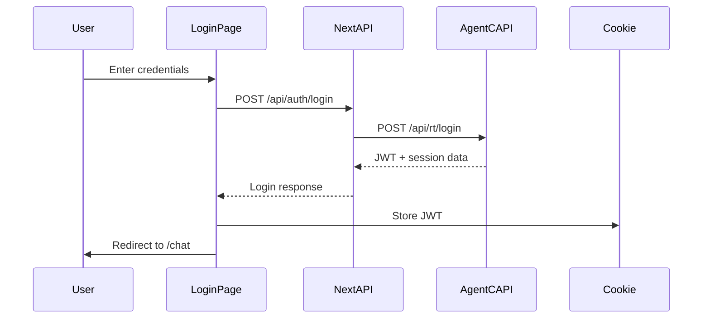

# Agent C Realtime Demo Application - Developer Guide

## Table of Contents
1. [Overview](#overview)
2. [Architecture](#architecture)
3. [App Router Structure](#app-router-structure)
4. [Authentication System](#authentication-system)
5. [Provider Hierarchy](#provider-hierarchy)
6. [API Routes](#api-routes)
7. [Key Components](#key-components)
8. [Configuration & Environment](#configuration--environment)
9. [Testing Infrastructure](#testing-infrastructure)
10. [Build & Deployment](#build--deployment)

## Overview

### Purpose
The demo application is a Next.js 14 reference implementation showcasing the Agent C Realtime SDK capabilities. Its primary purpose is to demonstrate:
- **UI Package Components**: All UI components come from `@agentc/realtime-ui` package
- **SDK Integration**: Proper integration patterns with `@agentc/realtime-core` and `@agentc/realtime-react`
- **Real-time Communication**: WebSocket-based chat and voice interactions
- **Authentication Flow**: JWT-based auth with secure cookie management
- **Production Patterns**: Best practices for building applications with the SDK

### Technology Stack
- **Framework**: Next.js 14 with App Router
- **UI Components**: @agentc/realtime-ui (CenSuite design system)
- **SDK**: @agentc/realtime-core, @agentc/realtime-react
- **Styling**: Tailwind CSS (minimal custom CSS, only login styles)
- **Authentication**: JWT with secure cookies
- **Forms**: React Hook Form + Zod validation
- **Testing**: Vitest + Happy DOM

## Architecture

### Monorepo Structure
```
realtime_client/
├── packages/
│   ├── core/       # Core SDK functionality
│   ├── react/      # React hooks and providers
│   ├── ui/         # UI components library
│   └── demo/       # This demo application
```

### Demo App Structure
```
packages/demo/
├── src/
│   ├── app/            # Next.js App Router pages
│   │   ├── api/        # API routes for auth proxy
│   │   ├── chat/       # Main chat interface
│   │   ├── login/      # Authentication page
│   │   └── page.tsx    # Root page (redirects based on auth)
│   ├── components/     # React components
│   │   ├── chat/       # Chat-specific components
│   │   ├── input/      # Input area wrapper
│   │   ├── layout/     # Layout components
│   │   └── providers/  # Context providers
│   ├── contexts/       # React contexts
│   ├── lib/           # Utility libraries
│   └── styles/        # Global CSS (minimal)
├── public/
│   └── worklets/      # Audio worklet files
└── next.config.js     # Next.js configuration
```

### Key Architectural Decisions
1. **Client-side Heavy**: Most logic runs client-side with SDK
2. **Minimal Custom UI**: Leverages UI package components
3. **Auth Proxy**: Next.js API routes proxy auth to backend
4. **Dynamic Imports**: Chat interface loaded dynamically to avoid SSR issues
5. **HTTPS Required**: Microphone access requires secure context

## App Router Structure

### Routes

#### `/` (Root)
- **Purpose**: Entry point that checks authentication
- **Behavior**: 
  - Authenticated → Redirect to `/chat`
  - Not authenticated → Redirect to `/login`
- **Implementation**: `src/app/page.tsx`

#### `/login`
- **Purpose**: User authentication interface
- **Features**:
  - Username/email + password form
  - Zod validation
  - Error handling with user feedback
  - Secure cookie storage on success
- **Implementation**: `src/app/login/page.tsx`

#### `/chat`
- **Purpose**: Main chat interface
- **Features**:
  - Real-time messaging
  - Voice interaction (PTT/VAD)
  - Avatar support
  - Session management
- **Implementation**: 
  - `src/app/chat/page.tsx` (dynamic import wrapper)
  - `src/components/chat/ChatPageClient.tsx` (main component)
- **Dynamic Loading**: Uses `next/dynamic` to prevent SSR issues with WebSocket

### API Routes

#### `/api/auth/login`
- **Method**: POST
- **Purpose**: Proxy authentication to Agent C backend
- **Flow**:
  1. Receive credentials from client
  2. Forward to Agent C API (`/api/rt/login`)
  3. Handle self-signed certs in development
  4. Return JWT and session data
- **Implementation**: `src/app/api/auth/login/route.ts`

#### `/api/auth/session`
- **Method**: GET  
- **Purpose**: Provide WebSocket connection info
- **Features**:
  - JWT validation
  - WebSocket URL construction
  - Session expiration checking
- **Implementation**: `src/app/api/auth/session/route.ts`

## Authentication System

### Authentication Flow


### JWT Management
- **Storage**: Secure, SameSite=strict cookies
- **Expiration Check**: 30-second buffer before expiry
- **Token Content**: Minimal (sub, exp, iat)
- **User Data**: Comes from WebSocket events, not JWT

### Auth Library (`src/lib/auth.ts`)
Key functions:
- `login(credentials)` - Authenticate user
- `logout()` - Clear tokens
- `getToken()` - Retrieve JWT
- `isAuthenticated()` - Check auth status
- `getAuthHeader()` - Create Authorization header

### Auth Context (`src/contexts/auth-context.tsx`)
Provides:
- Authentication state
- Login/logout methods
- Token helpers
- UI session ID management

## Provider Hierarchy

### Critical Provider Order
The providers MUST be nested in this specific order:

```tsx
<ThemeProvider>          // Theme context (light/dark)
  <AuthProvider>         // Authentication state
    <AuthGuard>          // Route protection
      <ClientProvider>   // SDK configuration
        <AgentCProvider> // WebSocket connection
          {children}
        </AgentCProvider>
      </ClientProvider>
    </AuthGuard>
  </AuthProvider>
</ThemeProvider>
```

### Provider Responsibilities

#### ThemeProvider
- Source: `src/components/theme-provider.tsx`
- Purpose: Dark/light theme management
- Uses: next-themes library

#### AuthProvider
- Source: `src/contexts/auth-context.tsx`
- Purpose: Authentication state management
- Features:
  - Token storage/retrieval
  - Login/logout actions
  - Session persistence

#### AuthGuard
- Source: `src/components/chat/ChatPageClient.tsx`
- Purpose: Route protection
- Behavior: Redirects to login if not authenticated

#### ClientProvider
- Source: `src/components/providers/client-provider.tsx`
- Purpose: Configure SDK client
- Configuration:
  - WebSocket URL
  - Auth token
  - Audio settings
  - Reconnection policy

#### AgentCProvider
- Source: `@agentc/realtime-react`
- Purpose: WebSocket connection management
- Features:
  - Auto-connection
  - Event handling
  - State management

## Key Components

### ChatLayout
- **Location**: `src/components/layout/ChatLayout.tsx`
- **Purpose**: Main container for chat interface
- **Structure**:
  ```
  [Sidebar] | [Header]
            | [Content Area]
            | [Input Area]
  ```

### ChatPageClient  
- **Location**: `src/components/chat/ChatPageClient.tsx`
- **Purpose**: Root component for chat page
- **Features**:
  - Provider setup
  - Auth checking
  - Output mode management

### InputAreaWrapper
- **Location**: `src/components/input/InputAreaWrapper.tsx`
- **Purpose**: SSR-safe wrapper for InputArea
- **Note**: Prevents TipTap editor from breaking build

### MainContentArea
- **Source**: `@agentc/realtime-ui`
- **Purpose**: Dynamic content display
- **Modes**: chat, voice, avatar

### ChatSidebar
- **Source**: `@agentc/realtime-ui`
- **Purpose**: Navigation and session management
- **Features**: Collapsible, session history

## Configuration & Environment

### Environment Variables

#### Required
```env
# Server-side only - Backend API for auth proxy
AGENT_C_API_URL=https://localhost:8000

# Client-side - WebSocket endpoint
NEXT_PUBLIC_AGENTC_API_URL=wss://localhost:8000

# Application URL
NEXT_PUBLIC_APP_URL=https://localhost:3000
```

#### Environment Management
- **File**: `src/env.mjs`
- **Library**: @t3-oss/env-nextjs
- **Validation**: Zod schemas
- **Type Safety**: Compile-time checking

### Next.js Configuration

#### next.config.js
```javascript
const nextConfig = {
  // Transpile UI package for framer-motion
  transpilePackages: ['@agentc/realtime-ui'],
  
  // Webpack configuration for monorepo
  webpack: (config) => {
    // Package resolution aliases
    config.resolve.alias = {
      '@agentc/realtime-core': '../core/dist',
      '@agentc/realtime-react': '../react/dist',
    };
    
    // Source maps in development
    if (dev) {
      config.devtool = 'eval-source-map';
    }
    
    return config;
  }
}
```

### HTTPS Configuration

#### Development Server
- **Certificates**: Self-signed for local dev
- **Location**: Project root certificates
- **Script**: `pnpm dev` (HTTPS), `pnpm dev:http` (HTTP fallback)

#### Certificate Setup
```bash
# Certificates expected at:
localhost_self_signed.pem      # Certificate
localhost_self_signed-key.pem  # Private key
```

### TypeScript Configuration

#### tsconfig.json
- **Target**: ES5 for browser compatibility
- **Module**: ESNext with bundler resolution
- **Strict Mode**: Enabled
- **Path Aliases**: `@/*` → `./src/*`

## Testing Infrastructure

### Test Framework
- **Runner**: Vitest
- **Environment**: Happy DOM
- **Config**: `vitest.config.ts`

### Test Structure
```
src/
├── __tests__/          # Component tests
├── test/
│   ├── mocks/         # Mock data
│   ├── utils/         # Test utilities
│   └── setup.ts       # Test environment setup
```

### Test Scripts
```bash
pnpm test           # Run all tests
pnpm test:watch     # Watch mode
pnpm test:coverage  # Coverage report
pnpm test:ui        # Vitest UI
```

### Coverage Configuration
- **Provider**: V8
- **Reports**: HTML, JSON, LCOV
- **Location**: `.scratch/coverage/demo/`

## Build & Deployment

### Build Process

#### Development
```bash
pnpm dev  # Start HTTPS dev server
```

#### Production Build
```bash
pnpm build  # Create optimized production build
pnpm start  # Start production server
```

### Build Output
- **Location**: `.next/`
- **Type**: Standard Next.js build
- **Optimization**: 
  - Code splitting
  - Dynamic imports
  - Tree shaking

### Deployment Considerations

#### Requirements
1. **Node.js**: 20.18.0 LTS or higher
2. **HTTPS**: Required for microphone
3. **WebSocket**: For real-time communication
4. **Environment**: Properly configured variables

#### Production Checklist
- [ ] Environment variables set
- [ ] SSL certificates configured
- [ ] WebSocket endpoint accessible
- [ ] Audio worklet files in public/
- [ ] Build passes without warnings

#### Performance Optimization
1. **Dynamic Imports**: Chat components loaded on-demand
2. **Bundle Size**: UI components from external package
3. **Caching**: Static assets cached appropriately
4. **Code Splitting**: Automatic via Next.js

### Docker Support (Future)
While no Dockerfile exists yet, the app is structured for containerization:
- Standalone output mode available
- Environment-based configuration
- Clear separation of concerns

## Development Workflow

### Setup
```bash
# Install dependencies
pnpm install

# Copy environment file
cp .env.example .env.local

# Edit environment variables
# Start development server
pnpm dev
```

### Code Quality
```bash
pnpm lint          # ESLint checks
pnpm format        # Prettier formatting
pnpm type-check    # TypeScript validation
```

### Common Tasks

#### Adding a Route
1. Create directory in `src/app/`
2. Add `page.tsx` file
3. Implement route component
4. Add auth guard if needed

#### Modifying Auth Flow
1. Update `src/lib/auth.ts`
2. Modify auth context if needed
3. Update API routes accordingly
4. Test cookie storage

#### Updating UI Components
1. Components come from `@agentc/realtime-ui`
2. Check package documentation
3. Update package version if needed
4. Test integration thoroughly

## Troubleshooting

### Common Issues

#### "WebSocket connection failed"
- Check NEXT_PUBLIC_AGENTC_API_URL
- Verify backend is running
- Check for CORS issues

#### "Microphone access denied"
- Ensure HTTPS is enabled
- Check browser permissions
- Verify certificate acceptance

#### "Build fails with TipTap error"
- Use InputAreaWrapper component
- Ensure dynamic imports for editor

#### "Authentication redirect loop"
- Clear cookies
- Check JWT expiration
- Verify auth context state

### Debug Mode
Enable debug logging:
```typescript
// In src/lib/auth.ts
const DEBUG_AUTH = true;

// In src/contexts/auth-context.tsx  
const DEBUG_AUTH = true;
```

## Best Practices

### Code Organization
1. Keep components small and focused
2. Use UI package components when available
3. Minimize custom CSS (use Tailwind)
4. Follow Next.js App Router patterns

### State Management
1. Use SDK hooks for real-time state
2. Keep auth state in context
3. Avoid prop drilling
4. Use server components where possible

### Performance
1. Dynamic import heavy components
2. Minimize bundle size
3. Use proper caching strategies
4. Optimize images and assets

### Security
1. Never expose sensitive tokens
2. Use secure cookies for auth
3. Validate all user inputs
4. Handle errors gracefully

## Resources

### Documentation
- [SDK Core Docs](/docs/api-reference/core/)
- [SDK React Docs](/docs/api-reference/react/)
- [UI Components Docs](/docs/api-reference/ui/)
- [Demo App Docs](/docs/api-reference/demo/)

### External
- [Next.js 14 Docs](https://nextjs.org/docs)
- [CenSuite Design System](https://censuite-ui.vercel.app/)
- [Tailwind CSS](https://tailwindcss.com/)
- [React Hook Form](https://react-hook-form.com/)

## Summary

The demo application serves as a comprehensive reference implementation showcasing:
- Proper SDK integration patterns
- Modern Next.js 14 App Router architecture
- Production-ready authentication flow
- Minimal custom code (leverages UI package)
- Best practices for real-time applications

It's designed to be both a working application and a learning resource for developers building with the Agent C Realtime SDK.