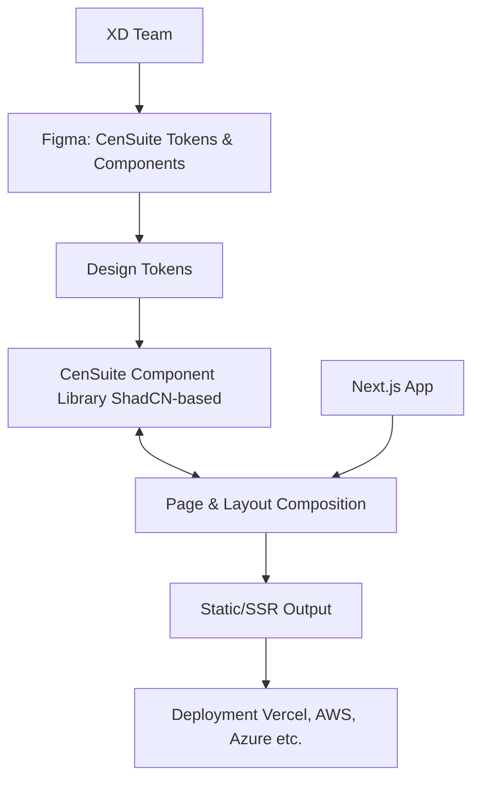

# Simple Next.js/ CenSuite Starter

A minimal Next.js 14 starter template using the App Router, ShadCN/UI, type-safe environment variables, built-in icon support, and preconfigured settings. Designed for simplicity, it offers a plug-and-play setup ideal for first-time Next.js and ShadCN users.

## Background

CenSuite is a design system focused on delivering better user experiences through faster, more consistent frontends. It blends expert-crafted UI patterns from the XD team with optimized React tooling to reduce development overhead and improve design accuracy. Every component is built to be accessible, responsive, and performant—helping teams ship applications that feel cohesive, intuitive, and fast. With over 50 reusable, fully customizable components styled using centralized design tokens, CenSuite dramatically reduces developer effort while ensuring brand and UX consistency out of the box.

Contact John Tourles (john.tourles@centricconsulting.com) to learn how CenSuite can streamline your next deliverable.



## System Requirements

- Node.js 20.18.0 LTS or higher

## Usage

```markdown
1. Clone this repository
```

2. Install the required depdencies

   ```bash
   pnpm install # Or package manager of choice
   ```

3. Copy `.env.example` to `.env.local`

   ```bash
   cp .env.example .env.local
   ```

4. Start the development server

   ```bash
   pnpm dev
   ```

5. Build the project

   ```bash
   pnpm build
   ```

## Features

- Next.js 14+ `/app` router
- TypeScript
- Tailwind CSS v3
- shadcn/ui (Radix UI + Tailwind)
- Prettier (w/ auto sort imports and tailwind classes)
- SEO optimized
- Typesafe env, icons, and config
- Ready to use - jump right into development

## Developer Resources

### Tools

- [v0](https://v0.dev/) - v0 is a state-of-the-art AI code generation tool trained on Next.js and ShadCN. It's capable of handling screenshots and turning them into copy-and-pasteable components, pages, functions, and more.
- [OpenNext](https://opennext.js.org/) - A collective initiative by AWS, Cloudflare, and Netlify to bring first-class support for Next.js to any platform.
- [Lucide React](https://lucide.dev/guide/packages/lucide-react) - Library of SVG-based icons to simplify development."

### Videos

- [Next.js Summarized in 100 seconds](https://www.youtube.com/watch?v=Sklc_fQBmcs)
- [ShadCN Explained](https://www.youtube.com/watch?v=yYKEvxFPy5Q)
- [Tailwind CSS in 100 seconds](https://www.youtube.com/watch?v=mr15Xzb1Ook)
- [ZOD Schema Validation](https://www.youtube.com/watch?v=9UVPk0Ulm6U)

### Documentation

- [CenSuite Docs](https://censuite-ui.vercel.app/) - Internal documentation maintained by the XD team and designed to provide better examples and clarifications than the official ShadCN docs.
- [Theming crash course](https://censuite-ui.vercel.app/docs/design/foundation/customization-and-theming) - Simple list of all native design variables for quick and easy reference.
- [Built-in Optimizations](https://nextjs.org/docs/14/app/building-your-application/optimizing) - Next.js comes with a variety of built-in optimizations designed to improve your application's speed and Core Web Vitals.
- [Next.js Docs](https://nextjs.org/docs/14/getting-started) - Official Next.js documentation.
- [Learn Next.js](https://nextjs.org/learn) - Guides and tutorials from the Next.js team.
- [Tailwind Docs](https://v3.tailwindcss.com/) - Documentation for the CSS library powering the design system.
- [TypeScript Docs](https://www.typescriptlang.org/) - Documentation for the TypeScript language.
